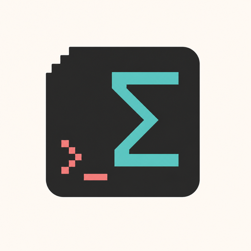
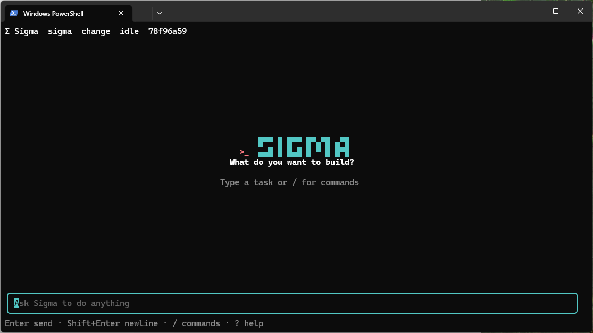
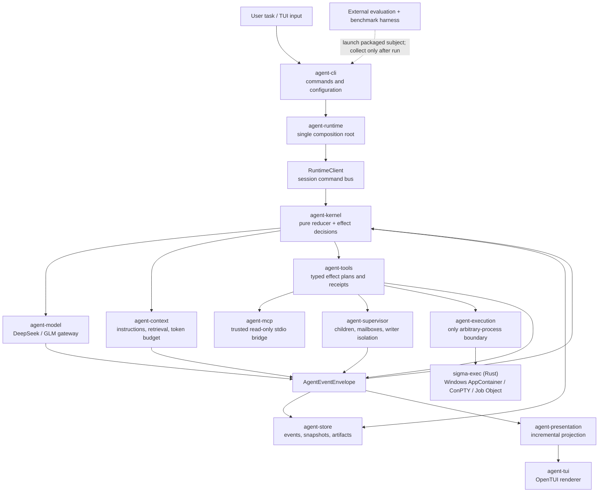

<p align="center">
  
</p>

<h1 align="center">Sigma Code</h1>

<p align="center">
  A durable, evidence-driven coding agent built around DeepSeek.<br>
  Plan, inspect, edit, execute, validate, review, and resume—all from the terminal.
</p>

<p align="center">
  <a href="README.md">English</a> · <a href="README.zh-CN.md">简体中文</a>
</p>

<p align="center">
  
  
  
</p>

<p align="center">
  
</p>

Sigma Code turns a coding task into a durable stream of typed decisions and evidence. It can explore a repository, make scoped changes, run sandboxed commands, validate the result, ask an independent reviewer, and recover the same session after interruption. The product uses one event-sourced kernel, one session format, and one terminal UI instead of separate execution paths that drift apart.

`v4.0.0-rc.1` is an unsigned Windows x64 preview release candidate. It is suitable
for evaluation and feedback, but it is not yet the stable `3.0.0` release. See the
[changelog](CHANGELOG.md), [security policy](SECURITY.md), and
[contribution guide](CONTRIBUTING.md) before reporting or proposing changes.

> [!IMPORTANT]
> **Current product boundary**
>
> - **The first signed binary release target is Windows x64.** `v4.0.0-rc.1` includes a directly usable but unsigned Windows x64 preview archive because trusted Windows code signing is not configured. Windows may show a SmartScreen warning. The repository contains a Linux sandbox backend and portable packaging work, but Linux is not a formally released product target yet.
> - **Formal evaluation and benchmark runs are currently DeepSeek-only.** Sigma's evaluator, Harbor adapter, and Terminal-Bench harness are maintained around DeepSeek; results from other providers are not used for formal claims.
> - The runtime contains DeepSeek and GLM/Z.ai gateway support, but the GLM path does not have the same formal evaluation coverage.
> - Sigma treats **OpenCode as a direct competitor and a product target, not a parity claim**. There is still a real gap between Sigma and OpenCode in overall practical performance and maturity today.

## Why Sigma Code

| Principle | What it means in practice |
| --- | --- |
| Durable by default | Commands, model turns, tool receipts, approvals, plans, evidence, and outcomes are stored as checksummed events and can be replayed. |
| Effects before execution | Every tool declares its possible effects; each call is narrowed to an exact plan before policy, approval, locking, checkpointing, and execution. |
| Current-state validation before “done” | The runtime completes only when semantic validation covers every net change on the current mutation frontier. |
| Fail-closed containment | Process execution defaults to a native sandbox with no network. If the required sandbox is unhealthy, Sigma refuses to execute. |
| One product path | CLI automation and the TUI use the same `RuntimeClient`, kernel, store, tools, recovery logic, and outcome protocol. |

## Quick start on Windows

> [!NOTE]
> `v4.0.0-rc.1` includes an unsigned Windows x64 preview archive. Verify its SHA-256
> sidecar before extraction. Windows may show a SmartScreen warning because the
> executables do not yet have a trusted Authenticode signature.

Download the latest Windows x64 archive from [GitHub Releases](https://github.com/hututuQQQ/sigma/releases) and extract it. The bundle includes its pinned Node.js runtime, the native `sigma-exec` broker, the TUI runtime, TypeScript/Python language-server assets, and tokenizer data; a separate Node.js installation is not required.

```powershell
$Sigma = "C:\Tools\sigma-code"
$Workspace = "D:\path\to\your\repository"

$env:DEEPSEEK_API_KEY = "your-api-key"

# One-time setup for the current Windows user.
& "$Sigma\bin\agent.cmd" sandbox setup

# Create workspace configuration, verify the runtime and provider, then enter the TUI.
& "$Sigma\bin\agent.cmd" init --workspace $Workspace --provider deepseek
& "$Sigma\bin\agent.cmd" doctor --workspace $Workspace --check-api
& "$Sigma\bin\agent.cmd" tui --workspace $Workspace
```

The example sets the key only for the current PowerShell process. Keep secrets out of `.agent/config.toml` and source control.

Official archives include a SHA-256 checksum, CycloneDX SBOM, signed provenance, and
the public provenance verification key. Windows executables are Authenticode-signed
and timestamped. See [SECURITY.md](SECURITY.md) for the trust boundary and
[RELEASING.md](RELEASING.md) for the maintainer process.

For a one-shot task:

```powershell
& "$Sigma\bin\agent.cmd" run "Fix the failing tests and explain the change" `
  --workspace $Workspace `
  --permission-mode auto
```

For read-only analysis:

```powershell
& "$Sigma\bin\agent.cmd" inspect "Map the request path and identify reliability risks" `
  --workspace $Workspace `
  --permission-mode auto
```

`run` uses **change** mode. `inspect` uses **analyze** mode and rejects tools whose declared effects include filesystem writes, unrestricted process spawning, or destructive work.

## What Sigma can do

- **Interactive coding:** use a CJK/IME-aware terminal UI with Markdown responses, activity views, command completion, multiline input, steering, follow-ups, scrolling, and approval overlays.
- **Repository intelligence:** bounded file listing and grep, repository statistics, Git status/diff, stable hash-aware reads, nested `AGENTS.md` discovery, and LSP-backed code intelligence when a supported server is available.
- **Scoped changes:** write and edit files, apply atomic multi-file patches, delete individual files, detect no-op writes, create mutation checkpoints, and restore the current run's latest sealed checkpoint.
- **Sandboxed execution:** run direct executables or platform shells, execute semantic validation, and manage background/PTY processes through broker-scoped session handles.
- **Evidence-based delivery:** record workspace deltas, commands, validation, diagnostics, reviews, child outcomes, and checkpoints in one typed evidence ledger.
- **Durable sessions:** list, inspect, replay, resume, cancel, steer, approve, and continue sessions after a process interruption.
- **Child agents:** delegate plan nodes to bounded child sessions; isolate writers in Git worktrees or narrow single-writer scopes, then explicitly integrate retained changes.
- **Extensibility:** load skills, profiles, and hooks through frozen/trusted customization boundaries, and connect explicitly trusted read-only MCP stdio servers.

## Architecture

`agent-runtime.createConfiguredRuntime` is the single production composition root. It wires the model routes, context provider, pure kernel, effect-aware tools, MCP clients, segmented event store, checkpoint manager, reviewer, supervisor, execution broker, and in-process `RuntimeClient`. The CLI creates that runtime; the TUI receives the client rather than rebuilding the agent loop.



### The event loop

1. A CLI/TUI command becomes a typed session command and durable event.
2. `agent-kernel` reduces the event stream into state and decides the next effect; it does not perform I/O itself.
3. `agent-runtime` executes that decision through protocol ports for the model, context, tools, store, review, or supervision.
4. Before a tool runs, Sigma freezes its exact read/write roots, network mode, process mode, idempotence, and checkpoint scope. Mode policy, approval, locks, and trust checks are evaluated against that plan.
5. The resulting receipt and evidence are appended as new events. The kernel then decides the next step from durable state, while `agent-presentation` projects the same events into CLI/TUI output.
6. A run ends only with a typed outcome: `Completed`, `NeedsInput`, `Cancelled`, `RecoverableFailure`, or `Fatal`.

This separation makes replay and recovery part of the normal execution model instead of a special UI feature.

### Package map

| Layer | Packages | Responsibility |
| --- | --- | --- |
| Contracts | `agent-protocol`, `agent-config` | Events, commands, outcomes, ports, tool effects, model capabilities, and the shared CLI/env/TOML schema. |
| Decision engine | `agent-kernel` | Pure state reduction, convergence rules, terminal protocol repair, and effect selection. |
| Intelligence | `agent-model`, `agent-context`, `agent-code-intel`, `agent-extensions` | Provider streaming, context fitting/compaction, repository instructions, LSP, skills, profiles, and hooks. |
| Capabilities | `agent-tools`, `agent-mcp` | Repository/file/process/control/supervisor tools and the MCP bridge, all behind declared effects. |
| Safety boundary | `agent-execution`, `agent-platform`, `agent-checkpoint`, `native/sigma-exec` | Path containment, process policy, native sandboxing, output redaction/artifacts, and transactional recovery. |
| Durability and coordination | `agent-store`, `agent-supervisor`, `agent-runtime` | Event persistence, snapshots, session ownership, child isolation, recovery, review, and composition. |
| Product surfaces | `agent-presentation`, `agent-tui`, `agent-cli` | Event projection, terminal interaction, automation commands, session administration, and diagnostics. |

The production package dependency graph is checked for cycles and packages communicate through public exports.

## Safety, permissions, and recovery

### Windows execution boundary

`agent-execution` is the only production package allowed to start arbitrary processes. It talks to the bundled Rust `sigma-exec` broker over a framed protocol. On Windows, each sandboxed command uses an AppContainer identity with scoped filesystem ACLs, a kill-on-close Job Object, capability-gated networking, and ConPTY for interactive processes.

The default policy is `sandbox=required` and `network=none`. Required isolation never falls back to a host process. Unsafe host execution requires both a home-level opt-in and a per-run request. The broker rebuilds the child environment from an allowlist, rejects secret-looking overrides, and redacts configured secret values from returned output.

Path containment and OS isolation are separate checks. Workspace tools reject lexical and symlink/junction escapes; `.git` and `.agent` remain protected from sandbox write grants.

### Checkpoints and durable state

Runtime state is stored outside the agent-writable workspace under a workspace-derived user-state directory:

```text
<user-state>/sigma/workspaces/<workspace-sha256>/stores/v4/sessions/<session-id>/
  meta.json
  events/000001.jsonl
  snapshots/000000000250.json
  artifacts/<sha256>
```

Event records have checksums and monotonic sequence numbers. Segments rotate at 8 MiB or 10,000 events, snapshots are written every 250 events and at rotation, and a torn final record can be repaired under the append lock. Resume restores pending approvals, follow-ups, discovered instructions, budgets, and safe idempotent work. Interrupted non-idempotent effects become `NeedsInput` instead of being silently replayed.

### Completion is a protocol action

A provider `stop` with substantive text is treated as completion intent, and `complete_task` accepts only a summary plus optional warnings. The runtime—not the model—derives plan completion and evidence from the current mutation frontier. Failed, stale, or incomplete semantic validation keeps the run open with a structured repair diagnostic.

All net changes require passed semantic validation on the current state. The standard profile runs independent review as advisory and records findings as warnings; the strict profile requires approval. Active non-detached children are joined before completion, and an unintegrated writer worktree keeps the parent open.

## Commands

| Command | Purpose |
| --- | --- |
| `agent tui --workspace .` | Open the interactive terminal UI. |
| `agent run "..." --workspace .` | Run a workspace-changing task. |
| `agent inspect "..." --workspace .` | Analyze without write-capable tools. |
| `agent sessions --workspace . --json` | List durable sessions. |
| `agent session show --latest --workspace .` | Inspect the latest session. |
| `agent replay --latest --workspace . --timeline` | Replay its event timeline. |
| `agent resume <session-id> --workspace .` | Continue a durable session. |
| `agent cancel <session-id> --workspace .` | Cancel an active session. |
| `agent approval <session-id> <request-id> --decision allow --workspace .` | Resolve a pending approval. |
| `agent doctor --workspace . --check-api` | Check configuration, sandbox, toolchains, and provider access. |
| `agent sandbox setup` | Prepare and self-test the Windows sandbox. |
| `agent init --workspace .` | Create `.agent/config.toml`. |

Stable process exit codes are `0` for `Completed`, `2` for `NeedsInput`, `130` for `Cancelled`, and `1` for recoverable or fatal failure.

### TUI controls

- `Enter`: send while idle, or steer the active run
- `Shift+Enter` / `Ctrl+J`: insert a line
- `Alt+Enter`: queue a follow-up
- `Ctrl+O`: collapse or expand activity
- `PgUp` / `PgDn`, `Ctrl+U` / `Ctrl+D`, mouse wheel: scroll
- `/new`, `/mode analyze|change`, `/followup`, `/activity`, `/help`, `/quit`: session commands
- First `Ctrl+C`: cancel; second press within 1.5 seconds: exit

## Configuration

Precedence is **CLI flags → environment → workspace `.agent/config.toml` → home `~/.sigma/config.toml` → defaults**. Unknown flags and TOML keys fail immediately. Workspace-authored MCP servers and executable hooks require an explicit digest-bound trust grant.

```toml
[model]
provider = "deepseek"
name = "auto"

[permissions]
mode = "ask"

[runtime]
run_deadline_sec = 900
model_deadline_sec = 120
stream_idle_sec = 45

[tools]
max_parallel = 4

[agents]
max_parallel = 4

[ui]
output_format = "text"

[tui]
fps = 30
```

DeepSeek uses `DEEPSEEK_API_KEY`. The runtime also recognizes `GLM_API_KEY`, `ZAI_API_KEY`, or `BIGMODEL_API_KEY` for the experimental GLM/Z.ai path, but formal Sigma evaluation remains DeepSeek-only.

## Evaluation and benchmark boundary

Sigma's formal experience evaluator runs the packaged product in fresh, opaque workspaces and reduces the durable event stream into separate correctness, safety, experience, and reliability results. The current manifest fixes formal evaluation to **DeepSeek** (currently `deepseek-v4-pro`). Terminal-Bench runs through the dedicated Harbor-compatible DeepSeek harness.

The evaluator may select a task, launch the packaged CLI, and collect artifacts after the run. It must not send scenario identity, verifier output, scores, rewards, hidden checks, or post-run failures into the solving session, and verifier feedback never triggers another solving attempt. This fairness boundary is enforced by protocol types and production-source scans.

```powershell
# Audit existing sessions without a model call.
pnpm eval:session -- --workspace . --latest 2

# DeepSeek-only live evaluation and benchmark paths.
pnpm eval:agent -- --suite quick
pnpm eval:agent -- --suite experience --repeat 3
pnpm bench:deepseek
```

No cross-provider benchmark conclusion should be inferred from these results.

## Build and develop

The repository pins Node.js `26.4.0`, pnpm `11.7.0`, and Rust `1.96.0`.

```powershell
corepack enable
corepack prepare pnpm@11.7.0 --activate
pnpm install --frozen-lockfile
pnpm build
cargo build --release --locked --manifest-path native/sigma-exec/Cargo.toml

pnpm lint
pnpm test:coverage
```

Build and verify the current official target:

```powershell
pnpm package:agent-cli:windows
pnpm verify:release:windows
```

After packaging, put the development key in the repository-local, gitignored `.env` file:

```dotenv
DEEPSEEK_API_KEY=your-api-key
```

Then launch the development TUI:

```powershell
pnpm tui:deepseek
```

Fake-gateway tests do not require provider credentials. See [VALIDATION.md](VALIDATION.md) for coverage thresholds, real-terminal boundaries, native sandbox checks, packaging proofs, and release gates.

## License

Sigma Code is available under the [MIT License](LICENSE).

## Direction

Sigma's near-term focus is deliberately narrow: make the Windows product dependable, deepen the DeepSeek-specific harness and long-session convergence, improve real task performance toward OpenCode, and keep evaluation feedback outside the solving boundary. Broader formal platform/provider support should follow demonstrated product reliability rather than lead it.
