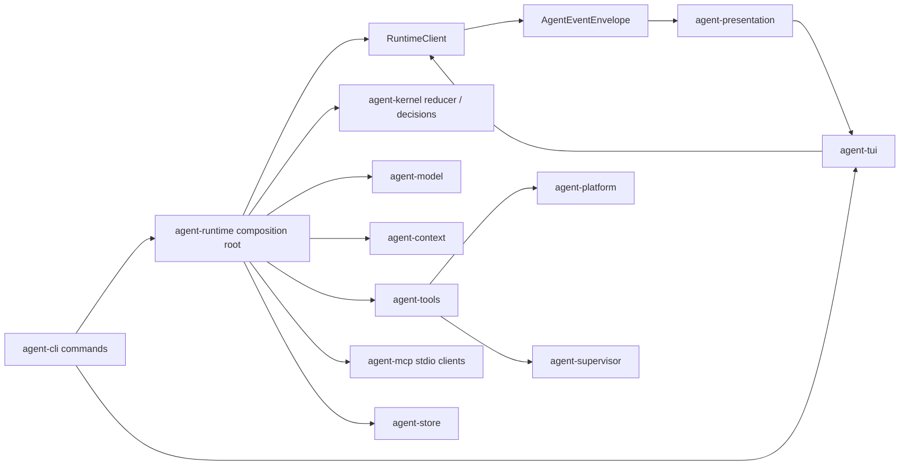

<p align="center">
  
</p>

# Sigma Code

Sigma Code is an event-sourced coding agent for DeepSeek and GLM. The shipped product has one kernel, one session format, and one terminal UI. Removed `agent-core`, `agent-ai`, controller/final-gate, and prior TUI components are not part of the runtime or portable package.

## Architecture



`agent-runtime.createConfiguredRuntime` is the only production composition root. It constructs the model gateway, context provider, tool registry, MCP clients, segmented store, supervisor, and in-process `RuntimeClient`. `agent-cli` parses commands/configuration and calls that public factory; `agent-tui` receives an injected `RuntimeClient` and depends only on `agent-protocol` and `agent-presentation`.

Workspace packages communicate through public exports, and the production dependency graph is required to be acyclic:

- `agent-protocol`: events, typed outcomes, context authority, and model/tool/store/runtime ports
- `agent-config`: the single CLI/env/TOML/default/help schema and command registry
- `agent-kernel`: pure state evolution and effect decisions
- `agent-model`: DeepSeek/GLM transport, tool-call aggregation, retry boundaries, deadlines, and cancellation
- `agent-store`: checksummed segmented JSONL, snapshots, and content-addressed artifacts
- `agent-context`: nested `AGENTS.md`, Unicode/CJK retrieval, repository context, and token budgeting
- `agent-platform`: workspace path containment, platform shell selection, and cancellable process trees
- `agent-tools`: structured repository/file/process/supervisor tools with declared effects
- `agent-mcp`: shell-free MCP stdio transport and remote-tool bridge
- `agent-supervisor`: bounded child scheduling, mailboxes, and writer isolation
- `agent-runtime`: composition, event execution, recovery, and session ownership
- `agent-presentation`: incremental event projection
- `agent-tui`: imperative OpenTUI Core renderer over the event-driven `RuntimeClient`
- `agent-cli`: thin user-command adapter

### Completion is a protocol action

A provider `stop` response or a natural-language claim does not finish a run. The agent must call `complete_task` with a non-empty summary and explicit acceptance criteria:

- every criterion must be `met` and cite at least one successful current-run tool receipt by call ID;
- unknown or failed receipt IDs reject the proposal;
- non-detached children are joined before completion, and a failed child or retained, unintegrated writer worktree keeps the parent run open.

When no actionable task was provided or a concrete decision is required, the agent calls `request_user_input`; this produces a durable `NeedsInput` outcome that can be continued in the same task. A natural `stop` before any tool work also falls back to `NeedsInput`. After tool work, the kernel permits one protocol-repair turn, then suspends instead of repeatedly buying identical model responses. Three consecutive identical tool batches and repeated output-limit continuations end as typed recoverable failures.

Rejected completion proposals become ordinary tool failures and the kernel continues from the durable state. Completion correctness comes from acceptance criteria and typed evidence; bounded convergence guards prevent provider or prompt failures from turning into an unbounded agent loop.

## Requirements

- Node.js `26.4.0` (pinned by `.node-version`, CI, package metadata, and the portable runtime)
- pnpm `11.7.0`
- for live model calls: `DEEPSEEK_API_KEY`, or one of `GLM_API_KEY`, `ZAI_API_KEY`, `BIGMODEL_API_KEY`

```powershell
corepack enable
corepack prepare pnpm@11.7.0 --activate
pnpm install --frozen-lockfile
pnpm build
pnpm --filter agent-cli start -- --help
```

Tests that use fake gateways do not require provider credentials.

## Commands and outcomes

```text
agent run "Fix failing tests" --workspace . --permission-mode auto
agent inspect "Review the architecture" --workspace . --permission-mode auto
agent tui --workspace .
agent sessions --workspace . --json
agent session show --latest --workspace .
agent replay --latest --workspace . --timeline
agent resume <session-id> --workspace .
agent cancel <session-id> --workspace .
agent approval <session-id> <request-id> --decision allow --workspace .
agent doctor --workspace . --check-api
```

`run` uses `change` mode. `inspect` uses `analyze` mode: tools declaring `filesystem.write`, unrestricted `process.spawn`, or `destructive` effects are denied, while read-only tools remain available. Policy is evaluated from `ToolDescriptor` effects and approval metadata, not from a hard-coded tool-name list.

A non-interactive `run` or `inspect` in `permissionMode=ask` returns `NeedsInput` before starting because no approval response can be collected. `--permission-mode auto` is an explicit unsafe opt-in that allows commands to access the host with the current user's authority; use it only for a workspace, instructions, and external tools you trust, or use the TUI for interactive approval.

Process exit codes are stable:

- `0`: `Completed`
- `2`: `NeedsInput`
- `130`: `Cancelled`
- `1`: `RecoverableFailure` or `Fatal`

## Configuration

Precedence is: CLI flags, environment, workspace `.agent/config.toml`, home `~/.sigma/config.toml`, then defaults. Unknown flags and unknown TOML keys fail immediately. Help, shell completions, `agent init`, and runtime settings are derived from the same schema.

```toml
[model]
provider = "deepseek"
name = "auto"

[permissions]
mode = "ask"

[runtime]
run_deadline_sec = 900
model_deadline_sec = 300
stream_idle_sec = 60

[tools]
max_parallel = 4

[agents]
max_parallel = 4

[ui]
output_format = "text"

[tui]
fps = 30
```

### MCP servers

MCP stdio servers can be declared in TOML, in the `SIGMA_MCP_SERVERS` JSON array, or with repeatable `--mcp-server <json>` flags. A TOML entry is explicit about the remote server's policy boundary:

```toml
[[mcp.servers]]
name = "workspace-tools"
command = "node"
args = ["tools/server.mjs"]
cwd = "."
possible_effects = ["filesystem.read", "network"]
approval = "prompt"
execution_mode = "sequential"
idempotent = false
timeout_ms = 120000
idle_timeout_ms = 30000
hard_deadline_ms = 120000
shutdown_grace_ms = 750
```

Repository-level MCP configuration never starts on first use. Review `.agent/config.toml`, then explicitly grant durable trust with `--trust-workspace-mcp`; the grant is stored outside the repository and is valid only for the canonical workspace path and exact configuration digest. Any configuration change requires trust again. MCP supplied explicitly by a CLI flag, environment, or the user's home configuration is not treated as repository-authored.

Sigma starts the configured executable directly, without a shell. Its working directory must resolve inside the workspace, and the child inherits only a small platform environment allowlist plus literal `env` entries from its configuration—not model keys or the rest of `process.env`. MCP requests have cancellation, idle timeout, and absolute deadline handling; shutdown escalates to process-tree termination after the grace period. Remote side effects cannot be inferred or verified from a tool name, so configure `possible_effects`, `approval`, and `idempotent` conservatively. Global `permissionMode=deny` still denies prompt-gated MCP tools, while `permissionMode=auto` accepts them.

## Permissions and containment

Each tool invocation receives its own `ToolExecutionContext` and `AbortSignal`. Descriptors declare possible effects, approval mode, idempotency, execution mode, resource keys, context/write-path arguments, idle timeout, and hard timeout. The runtime uses those declarations for mode checks, approval, locking, receipt reuse, nested `AGENTS.md` discovery, and workspace-delta evidence. A newly discovered nested instruction is durably recorded and any affected mutating/open-world call is deferred until the model replans with that instruction.

Filesystem tools reject lexical and symlink/junction escapes from the workspace. This is path containment, not an OS security sandbox. `agent doctor` intentionally reports that OS-level command sandboxing is not configured.

## Sessions and recovery

```text
<user-state>/sigma/workspaces/<workspace-sha256>/sessions/<sessionId>/
  meta.json
  events/000001.jsonl
  snapshots/000000000250.json
  artifacts/<sha256>
```

Events have checksums and monotonic sequence numbers. Segments rotate at 8 MiB or 10,000 events; snapshots are written every 250 events and on rotation. Event records and metadata are fsynced, a torn final record can be repaired under the append lock, and readers do not mutate the log.

Resume loads the newest valid snapshot, replays the remaining events, restores pending approvals, queued follow-ups, and dynamically discovered project instructions, restarts an interrupted model attempt from its durable boundary, and resets interrupted idempotent tools for safe re-execution. An interrupted non-idempotent tool becomes `NeedsInput` and requires an explicit retry decision.

Long histories are fitted with the gateway tokenizer contract. Older turns may be replaced in the request by a low-authority, provenance-tagged lossy summary; the full durable transcript remains in the store and `context.compacted` records the boundary.

Runtime state and its owner record live in the user's private state directory, outside the agent-writable workspace. The durable cross-process inbox accepts cancellation only; approvals, steering, and follow-ups must come through the controlling runtime/TUI and cannot be forged by writing a workspace file. Old workspace-local session directories are left untouched but are neither listed nor imported.

## Supervisor and writer isolation

The default child concurrency is four. Each child gets its own session transcript, context, receipts, and budget. Follow-ups use a bounded FIFO mailbox; non-detached children are joined when the parent proposes completion.

- Analyze children share the source workspace in read-only mode.
- A writer in a clean Git repository runs in a detached worktree.
- Writers in dirty Git or non-Git workspaces use a single-writer lease against the source workspace. They require a non-empty relative `writeScope`; path-addressable writes are checked before execution and broad mutation-capable process/MCP tools are denied in this shared mode.
- A changed worktree is retained until `integrate_agent` is called. Integration requires approval, verifies the source HEAD/status, rejects ignored files and changes outside the declared `writeScope`, copies the accepted delta, then removes the worktree.

`spawn_agent` itself is prompt-gated and declares the complete delegated effect set. Child approval requests are allowed only when every requested effect is inside that explicit grant; the decision is surfaced as a parent `child.message`. Undelegated effects are denied. Parent cancellation propagates to every non-detached child, and durable spawned/completed/integrated events prevent a resumed parent from silently ignoring interrupted child work.

## TUI

The TUI uses the imperative `@opentui/core` API: a responsive status bar, keyed/culled conversation viewport, compact or expanded activity, queued follow-up preview, a one-to-six-line composer, and help/approval overlays. Assistant replies render as Markdown, user input remains literal text, and oversized terminal message views retain their beginning and end with an explicit omission marker. Untrusted terminal controls are sanitized throughout. CJK, combining characters, emoji, IME/bracketed paste, mouse wheels, and 20×5 terminals are supported; alternate-screen, raw mode, cursor, subscriptions, and active sessions are restored or released on every exit path.

- Enter submits while idle and steers the active run; Shift+Enter or Ctrl+J inserts a line;
- Alt+Enter queues a follow-up (`/followup` is the compatibility form);
- `/new` cancels an active run and creates a new session;
- `/mode analyze|change` changes the next run mode;
- `/activity` collapses or expands activity;
- `/help`, an empty-input `?`, and `/` completion expose the same command registry;
- PgUp/PgDn, Ctrl+U/Ctrl+D, and the mouse wheel scroll without stealing composer focus;
- the first Ctrl+C cancels, and a second within 1.5 seconds exits.

Steering rejects stale model/tool turns before they can start later effects. Follow-ups are durably recorded as queued/delivered events and recover in FIFO order. Both queues reject new input at their 256-message capacity rather than overwriting existing entries. See [VALIDATION.md](./VALIDATION.md) for renderer and real-terminal CI boundaries.

## Development and release

```powershell
pnpm lint
pnpm test:coverage
pnpm test:harbor
pnpm smoke:product
pnpm smoke:tui-product
pnpm verify:containment
pnpm verify:package:agent-cli
```

`pnpm lint` runs TypeScript, ESLint complexity/function-size rules, dependency-cycle/public-export checks, Knip, and production file-size guards. Coverage gates are global and stricter for kernel/protocol/store; the exact commands and thresholds are documented in [VALIDATION.md](./VALIDATION.md).

Development and release use Node `26.4.0`. TUI entry points add `--experimental-ffi` automatically; direct `runTuiApp` callers must start Node with that flag. Portable Linux and Windows packages recursively deploy the complete production dependency graph, preserve nested version conflicts, select optional dependencies for the target OS/CPU/libc, assert the matching OpenTUI native runtime, and bundle Node `26.4.0`. Linux remains glibc-targeted. The structural package check is cross-platform; executing a target wrapper requires a supported native or WSL environment for that target.

## Evaluation fairness boundary

Evaluation adapters may select a task, launch the packaged CLI, and collect results after the run. They remain outside production packages. Evaluation identity, hidden checks, scores, evaluator logs, and post-run failures are not solver context and cannot trigger another solver attempt.

The type boundary reinforces this rule: solver-visible `AgentEventEnvelope` and `ContextItem` authorities exclude `external_verifier`; `ExternalEvaluationReport` is written only through a separate `EvaluationSink`. A production-source scan rejects benchmark/verifier/task-identity control flow, and the product gate contains no post-evaluation retry path.
