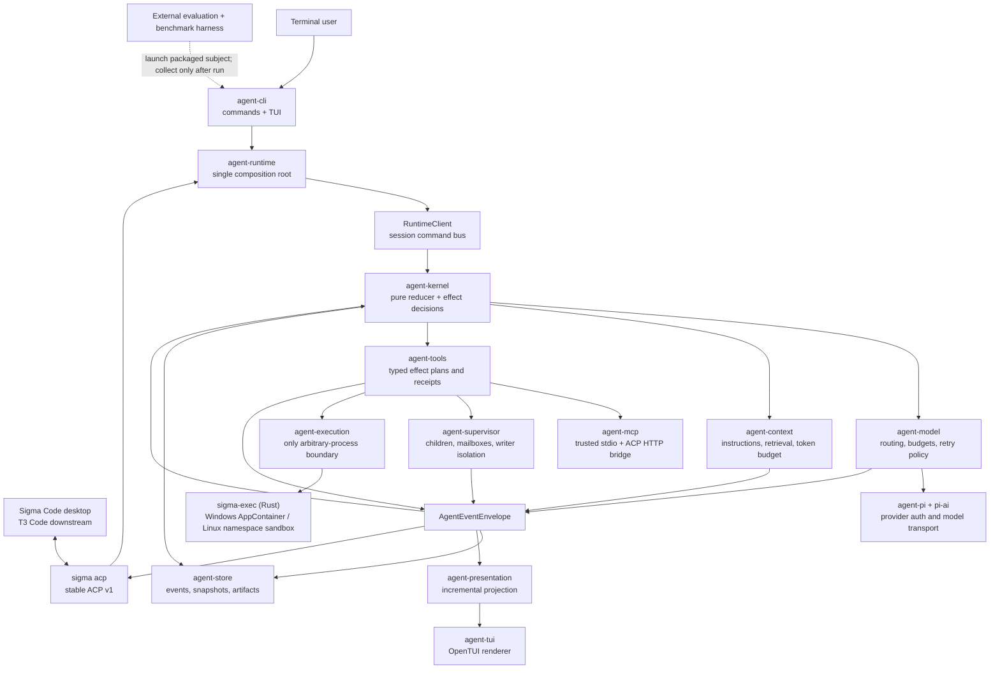

<p align="center">
  
</p>

<h1 align="center">Sigma Code</h1>

<p align="center">
  The open-source coding agent that survives interruptions and proves its changes.<br>
  Run long coding tasks in a native sandbox, resume anytime, and finish with evidence.
</p>

<p align="center">
  <a href="README.md">English</a> · <a href="README.zh-CN.md">简体中文</a>
</p>

<p align="center">
  <a href="https://github.com/hututuQQQ/sigma/releases/tag/v0.1.4"></a>
  
  
</p>

<p align="center">
  <a href="https://github.com/hututuQQQ/sigma/releases/tag/v0.1.4"><strong>Download v0.1.4</strong></a>
  · <a href="https://github.com/hututuQQQ/sigma-code">Desktop client source</a>
  · <a href="SECURITY.md">Security</a>
</p>

<p align="center">
  
</p>

<p align="center">
  <sub>
    The <a href="https://github.com/hututuQQQ/sigma-code">Sigma Code desktop client</a> is an independently maintained downstream of
    <a href="https://github.com/pingdotgg/t3code">T3 Code</a> and connects to this runtime over ACP v1.
  </sub>
</p>

Sigma Code is built for coding tasks that must not lose their state or declare victory too early. It runs commands inside a required native sandbox, persists the full working session so it can resume after interruption, and completes only after current changes are validated and any required review is satisfied. This repository owns Sigma Runtime, the CLI, and the TUI; the desktop, Web, and mobile client lives in [hututuQQQ/sigma-code](https://github.com/hututuQQQ/sigma-code). Every surface uses the same event-sourced kernel, session store, tools, recovery logic, and outcome protocol, either in process through `RuntimeClient` or over stable ACP v1.

`0.1.4` is the current supported product baseline.
Linux x64 is the stable release target. Windows x64 remains an explicitly
unsigned preview until trusted Authenticode signing is available. See the [security
policy](SECURITY.md) and [contribution guide](CONTRIBUTING.md) before reporting
or proposing changes.

> [!TIP]
> **OpenCode comparison—same model, all 89 tasks:** Sigma Code + DeepSeek completed **51/89 (57.303%)** while OpenCode + DeepSeek completed **49/89 (55.056%)**, a difference of **+2 passes / +2.247 percentage points**. Both agents ran DeepSeek `deepseek-v4-pro` on the same Terminal-Bench 2.1 population; Sigma used one attempt per task, zero retries, and no verifier feedback. Methodology and limitations are documented under [Evaluation and benchmark boundary](#evaluation-and-benchmark-boundary).

> [!IMPORTANT]
> **Current product boundary**
>
> - **[Sigma Code 0.1.4](https://github.com/hututuQQQ/sigma/releases/tag/v0.1.4) is stable on Linux x64; Windows x64 is an unsigned preview.** The Windows installer contains both the Sigma Code desktop UI and the verified Sigma Runtime, so users do not need a separate Node.js or agent CLI installation. Release candidates must pass native sandbox, packaged-product, checksum, SBOM, and signed-provenance gates. Windows executables do not yet have a trusted Authenticode signature and may trigger Windows security warnings.
> - **Formal evaluation is preregistered, not provider-coded.** The SHA-bound run manifest freezes the provider, model, source, archive, task selection, network, timeouts, concurrency, attempts, and retries before execution.
> - Provider comparisons are valid only when their SHA-bound run manifests freeze comparable controls; the harness does not infer comparability from a model name.

## Why Sigma Code

| Core capability | What it means for you |
| --- | --- |
| Native sandbox execution | Commands stay inside required OS-level isolation. If the sandbox is unhealthy, Sigma refuses to execute. |
| Sessions that survive interruption | Commands, model turns, tool receipts, plans, and outcomes are persisted as checksummed events, so the same task can be resumed and replayed. |
| Evidence before completion | Model prose alone cannot mark changed work as done. Sigma requires current-state validation and any required review evidence. |

## Sigma Code desktop and T3 integration

The [Sigma Code client](https://github.com/hututuQQQ/sigma-code) is an independently maintained desktop, Web, and mobile downstream of [T3 Code](https://github.com/pingdotgg/t3code). The original T3 Code license and attribution are preserved in that repository; the downstream is not affiliated with or endorsed by T3 Tools, Inc.

The Windows installer published from this repository bundles the client with the exact verified Sigma Runtime from the same release. Its first-party Sigma provider starts the long-lived `sigma acp` server and communicates through newline-delimited JSON-RPC over stdio. The v0.1.4 bridge supports:

- creating, listing, loading, resuming, closing, cancelling, and steering durable sessions;
- streamed model and reasoning text, plans, tool calls, approvals, usage, context-window status, hooks, and child-agent lifecycle events;
- image prompts, structured user questions, authoritative persisted history, and append-only message rollback;
- model and model-specific reasoning-level selection, trusted skill discovery, and client-supplied Streamable HTTP MCP servers.

For the first-party Sigma provider, the client remains a presentation surface: execution, permissions, sandboxing, persistence, validation, review, and recovery stay authoritative in Sigma Runtime.

<details>
<summary><strong>Terminal UI</strong></summary>

<p align="center">
  
</p>

</details>

## Quick start on Linux

Obtain the `0.1.4` Linux x64 stable archive from a verified project release or
build it from source, verify its SHA-256 sidecar and signed provenance, and
extract it:

```sh
SIGMA="$HOME/.local/share/sigma-code"
WORKSPACE="/path/to/your/repository"

export DEEPSEEK_API_KEY="your-api-key"

"$SIGMA/bin/agent" init --workspace "$WORKSPACE" --provider deepseek
"$SIGMA/bin/agent" doctor --workspace "$WORKSPACE" --check-api
"$SIGMA/bin/agent" tui --workspace "$WORKSPACE"
```

## Quick start on Windows (unsigned preview)

> [!WARNING]
> The Windows x64 archive is an unsigned preview, not an official trusted Windows
> binary release. Verify its SHA-256 sidecar and signed provenance before extraction.
> Its executables do not have a trusted Authenticode signature, so Windows SmartScreen
> or Smart App Control may warn or block execution.

For the complete desktop product, download `Sigma-Code-0.1.4-x64.exe` from the
[Sigma Code v0.1.4 release](https://github.com/hututuQQQ/sigma/releases/tag/v0.1.4), verify its
SHA-256 sidecar, and run the installer. It installs the Sigma Code UI together
with the verified Sigma Runtime; no separate Node.js or agent CLI installation
is required.

The bundled UI is built from [hututuQQQ/sigma-code](https://github.com/hututuQQQ/sigma-code) and launches the Runtime through `sigma acp`. In Settings, choose a Sigma model connection and authenticate with the method exposed by that provider. The default desktop path uses the experimental ChatGPT/Codex subscription connection; supported Pi providers can expose API-key or OAuth methods through the same Runtime-owned interface.

The `agent-cli-win32-x64.zip` asset remains available for terminal-only and
portable use. It includes pinned Node.js, the native `sigma-exec` broker, the
TUI runtime, TypeScript/Python language-server assets, and tokenizer data.

```powershell
$Sigma = "C:\Tools\sigma-code"
$Workspace = "D:\path\to\your\repository"

$env:DEEPSEEK_API_KEY = "your-api-key"

# One-time setup for the current Windows user.
& "$Sigma\bin\agent.cmd" sandbox setup

# Create workspace configuration, verify the runtime and provider, then enter the TUI.
& "$Sigma\bin\agent.cmd" init --workspace $Workspace --provider deepseek
& "$Sigma\bin\agent.cmd" doctor --workspace $Workspace --check-api
& "$Sigma\bin\agent.cmd" tui --workspace $Workspace
```

The example sets the key only for the current PowerShell process. Keep secrets out of `.agent/config.toml` and source control.

Published archives include a SHA-256 checksum, CycloneDX SBOM, signed
provenance, and the public provenance verification key. Linux x64 is stable at
`0.1.4`; Windows x64 remains an unsigned preview. See
[SECURITY.md](SECURITY.md) for the trust boundary and
[RELEASING.md](RELEASING.md) for the maintainer process.

For a one-shot task:

```powershell
& "$Sigma\bin\agent.cmd" run "Fix the failing tests and explain the change" `
  --workspace $Workspace `
  --permission-mode auto
```

For read-only analysis:

```powershell
& "$Sigma\bin\agent.cmd" inspect "Map the request path and identify reliability risks" `
  --workspace $Workspace `
  --permission-mode auto
```

`run` uses **change** mode. `inspect` uses **analyze** mode and rejects tools whose declared effects include filesystem writes, unrestricted process spawning, or destructive work.

## What Sigma can do

- **Desktop and terminal interaction:** use the [Sigma Code desktop client](https://github.com/hututuQQQ/sigma-code) through ACP v1, or a CJK/IME-aware terminal UI with Markdown responses, activity views, command completion, multiline input, steering, follow-ups, scrolling, and approval overlays.
- **Unified model access:** search the pinned Pi catalog, authenticate provider connections, select model-specific reasoning levels, and retain explicit metered, subscription, or unknown-price billing semantics.
- **Repository intelligence:** bounded file listing and grep, repository statistics, Git status/diff, stable hash-aware workspace and declared host-input reads, nested `AGENTS.md` discovery, and LSP-backed code intelligence when a supported server is available.
- **Scoped changes:** write and edit files, apply atomic multi-file patches, delete individual files, detect no-op writes, create mutation checkpoints, and restore the current run's latest sealed checkpoint.
- **Sandboxed execution:** run direct executables or platform shells, execute semantic validation, manage background/PTY processes through broker-scoped session handles, and explicitly hand off verified Linux deliverable services.
- **Read-only Web research:** use `web_run` (`web.run` in documentation) to search, open, find, and follow numbered static links. Results retain durable references and are always marked as untrusted external content.
- **Evidence-based delivery:** record workspace deltas, commands, validation, diagnostics, reviews, child outcomes, and checkpoints in one typed evidence ledger.
- **Durable sessions:** list, inspect, replay, resume, cancel, steer, approve, and continue sessions after a process interruption.
- **Child agents:** delegate plan nodes to bounded child sessions; isolate writers in Git worktrees or narrow single-writer scopes, then explicitly integrate retained changes.
- **Long-running reliability:** compact context before the provider window is exhausted, recover boundedly from transient stream closures, and isolate reviewer sessions and child runs from later turns.
- **Extensibility:** load skills, profiles, and hooks through frozen/trusted customization boundaries, connect explicitly trusted read-only MCP stdio servers, and accept read-only Streamable HTTP MCP servers supplied by an ACP client.

## Architecture

`agent-runtime.createConfiguredRuntime` is the single production composition root. It wires the model routes, context provider, pure kernel, effect-aware tools, MCP clients, segmented event store, checkpoint manager, reviewer, supervisor, execution broker, and in-process `RuntimeClient`. The CLI creates that runtime; the TUI receives the client rather than rebuilding the agent loop, and `sigma acp` projects the same runtime to clients such as Sigma Code.


```mermaid
flowchart TB
  USER["Terminal user"] --> CLI["agent-cli<br/>commands + TUI"]
  DESKTOP["Sigma Code desktop<br/>T3 Code downstream"] <--> ACP["sigma acp<br/>stable ACP v1"]
  CLI --> ROOT["agent-runtime<br/>single composition root"]
  ACP --> ROOT
  ROOT --> CLIENT["RuntimeClient<br/>session command bus"]
  CLIENT --> KERNEL["agent-kernel<br/>pure reducer + effect decisions"]

  KERNEL --> MODEL["agent-model<br/>routing, budgets, retry policy"]
  MODEL --> PI["agent-pi + pi-ai<br/>provider auth and model transport"]
  KERNEL --> CONTEXT["agent-context<br/>instructions, retrieval, token budget"]
  KERNEL --> TOOLS["agent-tools<br/>typed effect plans and receipts"]
  KERNEL --> STORE["agent-store<br/>events, snapshots, artifacts"]

  TOOLS --> MCP["agent-mcp<br/>trusted stdio + ACP HTTP bridge"]
  TOOLS --> SUP["agent-supervisor<br/>children, mailboxes, writer isolation"]
  TOOLS --> EXEC["agent-execution<br/>only arbitrary-process boundary"]
  EXEC --> NATIVE["sigma-exec (Rust)<br/>Windows AppContainer / Linux namespace sandbox"]

  MODEL --> EVENTS["AgentEventEnvelope"]
  CONTEXT --> EVENTS
  TOOLS --> EVENTS
  SUP --> EVENTS
  EVENTS --> STORE
  EVENTS --> KERNEL
  EVENTS --> PRESENT["agent-presentation<br/>incremental projection"]
  PRESENT --> TUI["agent-tui<br/>OpenTUI renderer"]
  EVENTS --> ACP

  EVAL["External evaluation + benchmark harness"] -.->|"launch packaged subject; collect only after run"| CLI
```

### The event loop

1. A CLI, TUI, or ACP command becomes a typed session command and durable event.
2. `agent-kernel` reduces the event stream into state and decides the next effect; it does not perform I/O itself.
3. `agent-runtime` executes that decision through protocol ports for the model, context, tools, store, review, or supervision.
4. Before a tool runs, Sigma freezes its exact read/write roots, network mode, process mode, idempotence, and checkpoint scope. Mode policy, approval, locks, and trust checks are evaluated against that plan.
5. The resulting receipt and evidence are appended as new events. The kernel then decides the next step from durable state, while `agent-presentation` and the ACP bridge project the same events into terminal or desktop updates.
6. A run ends only with a typed outcome: `Completed`, `NeedsInput`, `Cancelled`, `RecoverableFailure`, or `Fatal`.

This separation makes replay and recovery part of the normal execution model instead of a special UI feature.

### Package map

| Layer | Packages | Responsibility |
| --- | --- | --- |
| Contracts | `agent-protocol`, `agent-config` | Events, commands, outcomes, ports, tool effects, model capabilities, and the shared CLI/env/TOML schema. |
| Decision engine | `agent-kernel` | Pure state reduction, convergence rules, terminal protocol repair, and effect selection. |
| Intelligence | `agent-model`, `agent-pi`, `agent-context`, `agent-code-intel`, `agent-extensions` | Model policy, unified Pi provider transport, context fitting/compaction, repository instructions, LSP, skills, profiles, and hooks. |
| Capabilities | `agent-tools`, `agent-web`, `agent-mcp` | Repository/file/process/control/supervisor tools, brokered Web research, and the MCP bridge, all behind declared effects. |
| Safety boundary | `agent-execution`, `agent-platform`, `agent-checkpoint`, `native/sigma-exec` | Path containment, process policy, native sandboxing, output redaction/artifacts, and transactional recovery. |
| Durability and coordination | `agent-store`, `agent-supervisor`, `agent-runtime` | Event persistence, snapshots, session ownership, child isolation, recovery, review, and composition. |
| Product surfaces | `agent-presentation`, `agent-tui`, `agent-cli`; downstream `sigma-code` | Event projection, terminal interaction, automation commands, ACP v1, desktop interaction, session administration, and diagnostics. |

The production package dependency graph is checked for cycles and packages communicate through public exports.

## Safety, permissions, and recovery

### Execution boundary

`agent-execution` is the only production package allowed to start arbitrary processes. It talks to the bundled Rust `sigma-exec` broker over a framed protocol. On Windows, each sandboxed command uses an AppContainer identity with scoped filesystem ACLs, a kill-on-close Job Object, capability-gated networking, and ConPTY for interactive processes. Linux uses the native namespace sandbox and a watchdog for process-tree cleanup.

Configuration schema 1 defaults to `permission_mode=workspace-auto`,
`sandbox=required`, `read_scope=workspace`, `network=full`,
`web.mode=auto`, `process_handoff=allow`, and the native sandbox backend. Workspace-scoped reads
and declared writes run automatically; external reads, full-network calls, and
repository metadata writes remain separately authorized. An explicit
`network=none` or `network=loopback` setting narrows the capability. Required
isolation never falls back to host execution, and `container` mode fails with
`container_unavailable` until a real OCI backend is installed.

`web_run` is exposed only when full network access is enabled, Web mode is not
disabled, and the connected broker advertises the restricted Web protocol. Its
session grant is scoped to read-only Web access and cannot authorize shell,
process, or MCP networking. The broker permits public HTTP(S) ports 80/443,
binds every request to an approved origin and method, and rejects local,
private, reserved, credential-bearing, or active browser content.

Absolute external inputs are read through stable no-follow traversal and produce `input_access` evidence with path, digest, and size. Process calls mount only their declared stable read roots. A failed goal input remains an unresolved completion obligation until the same external path is read successfully; a run-created fixture cannot replace it.

Path containment and OS isolation are separate checks. Workspace tools reject lexical and symlink/junction ancestor escapes; creating a workspace symlink object such as a virtual-environment interpreter link is allowed without granting writes to its external target. `.git` and `.agent` remain protected from sandbox write grants.

Linux advertises `processHandoff` only when safe transfer is available. A `deliverable` process uses detached stdio, cannot use PTY/stdin, and must be independently health-checked before `process_handoff`. Handoff removes it from session cleanup; unhanded processes are still terminated on failure, cancellation, timeout, or broker loss. Windows currently advertises this capability as unavailable and fails closed.

### Checkpoints and durable state

Runtime state is stored outside the agent-writable workspace under a workspace-derived user-state directory:

```text
<user-state>/sigma/workspaces/<workspace-sha256>/stores/v1/sessions/<session-id>/
  meta.json
  events/000001.jsonl
  snapshots/000000000250.json
  artifacts/<sha256>
```

Event records have checksums and monotonic sequence numbers. Segments rotate at 8 MiB or 10,000 events, snapshots are written every 250 events and at rotation, and a torn final record can be repaired under the append lock. Resume restores pending approvals, follow-ups, discovered instructions, budgets, and safe idempotent work. Interrupted non-idempotent effects become `NeedsInput` instead of being silently replayed.

### Completion is a protocol action

A provider `stop` is only `model_stopped`. The Completion Coordinator independently derives assurance and review requirements from the current mutation frontier and emits `run.completed` only when `model_stopped`, `assurance_satisfied`, and `review_satisfied` are all true. Failed, stale, weak, or incomplete semantic validation produces structured repair guidance or a typed blocker; the model has no completion tool that can bypass the gate.

All net changes require passed semantic validation on the current state. Sealed
no-op checkpoints do not advance that frontier; mutating validation is rebound
after its checkpoint seals. The standard profile requires current-frontier
review approval or an explicit one-time user waiver. The strict profile does
not accept a waiver and requires approval backed by a reviewer-executed check.
Active non-detached children are joined before completion, and an unintegrated
writer worktree keeps the parent open.

### Current serialized and tool contracts

- Every Sigma-owned serialized boundary uses strict `schemaVersion: 1` (or
  `schema_version = 1` in TOML and `version: 1` for local provider, workspace
  trust, and ACP indexes). Unknown schemas, malformed current documents,
  another store layout, and old checkpoint journals fail with
  `unsupported_schema_version`, `persisted_state_invalid`, or
  `unsupported_store_layout`; the rejected files are never rewritten,
  migrated, or deleted.
- A verified shell exposes one `shell` contract for foreground, validation,
  background, and disposable-environment execution. Direct `exec`, `validate`,
  and `process_spawn` contracts exist only when no verified shell is available;
  retired tool names and argument shapes are not registered for replay.
- Active review is read-only and runs checks in a disposable overlay. It can
  inspect the authenticated current frontier and durable process lifecycle
  evidence without writing the parent workspace.
- At an ordinary solver-budget boundary, already-started session processes are
  allowed to settle within the outer deadline. Deliverable processes remain
  session-owned until an independently health-checked `process_handoff`
  succeeds.
- `write` and `edit` report the resulting byte length and SHA-256;
  `write_chunk` uses an expected preimage length and digest. An omitted shell is
  resolved deterministically by the broker. Non-UTF-8 process output must be
  preserved as a byte-safe artifact; a decoding error without that artifact is
  rejected as a broker protocol violation.
- `inspect_image` and `inspect_document` are bounded, offline, read-only
  fallbacks for text-only providers. Their OCR or extraction metadata is
  inspection data, not completion evidence.

## Commands

| Command | Purpose |
| --- | --- |
| `agent tui --workspace .` | Open the interactive terminal UI. |
| `agent run "..." --workspace .` | Run a workspace-changing task. |
| `agent inspect "..." --workspace .` | Analyze without write-capable tools. |
| `sigma acp` | Serve stable ACP v1 as newline-delimited JSON-RPC over stdio for clients such as Sigma Code. |
| `agent sessions --workspace . --json` | List durable sessions. |
| `agent session show --latest --workspace .` | Inspect the latest session. |
| `agent replay --latest --workspace . --timeline` | Replay its event timeline. |
| `agent resume <session-id> --workspace .` | Continue a durable session. |
| `agent cancel <session-id> --workspace .` | Cancel an active session. |
| `agent approval <session-id> <request-id> --decision allow --workspace .` | Resolve a pending approval. |
| `agent doctor --workspace . --check-api` | Check configuration, sandbox, toolchains, and provider access. |
| `sigma auth list --json` | List Pi provider authentication methods and local/ambient status without network access. |
| `sigma auth status <provider> --json` | Read one provider's local authentication state without refreshing OAuth. |
| `sigma auth login <provider> --method <method-id> --json` | Start a machine-readable API-key or OAuth login flow. |
| `sigma auth logout <provider> --json` | Remove that provider's locally stored credential; ambient credentials remain visible. |
| `sigma models list --json` | Read the pinned static model directory plus the offline dynamic cache. |
| `sigma models refresh <provider> --json` | Explicitly refresh a dynamic provider's model directory. |
| `agent sandbox setup` | Prepare and self-test the Windows sandbox. |
| `agent init --workspace .` | Create `.agent/config.toml`. |

Stable process exit codes are `0` for `Completed`, `2` for `NeedsInput`, `130` for `Cancelled`, and `1` for recoverable or fatal failure.

### TUI controls

- `Enter`: send while idle, or steer the active run
- `Shift+Enter` / `Ctrl+J`: insert a line
- `Alt+Enter`: queue a follow-up
- `Ctrl+O`: collapse or expand activity
- `PgUp` / `PgDn`, `Ctrl+U` / `Ctrl+D`, mouse wheel: scroll
- `/new`, `/mode analyze|change`, `/followup`, `/activity`, `/help`, `/quit`: session commands
- First `Ctrl+C`: cancel; second press within 1.5 seconds: exit

## Configuration

Precedence is **CLI flags → environment → workspace `.agent/config.toml` → home `~/.sigma/config.toml` → defaults**. Unknown flags and TOML keys fail immediately. Workspace-authored MCP servers and executable hooks require an explicit digest-bound trust grant.

The packaged default is the experimental `openai-codex` subscription provider with automatic model selection. The example below explicitly selects DeepSeek for an API-key-based setup:

```toml
schema_version = 1

[model]
provider = "deepseek"
name = "auto"
reasoning_effort = "auto"

[permissions]
mode = "workspace-auto"

[security]
sandbox = "required"
read_scope = "workspace"
network = "full"
process_handoff = "allow"

[web]
mode = "auto"
search_provider = "exa"

[runtime]
run_deadline_sec = 0
model_deadline_sec = 120
stream_idle_sec = 45

[tools]
max_parallel = 4

[agents]
max_parallel = 4

[ui]
output_format = "text"

[tui]
fps = 30
```

`runtime.run_deadline_sec = 0` leaves an interactive run unbounded. Set a
positive value only when the caller intentionally wants a whole-run wall-clock
limit. Per-request and per-tool liveness timeouts remain independent so a hung
provider or process can still be interrupted without imposing a task deadline.

To opt into broader per-call capabilities, use:

```toml
schema_version = 1

[security]
sandbox = "required"
read_scope = "host"
network = "full"
process_handoff = "deny"
```

`agent init` writes the current schema directly. Sigma does not expose a
configuration migration command and does not read another durable store layout.
Back up or move incompatible state yourself; rejection is deliberately
read-only.

### ChatGPT/Codex subscription provider (experimental)

Sigma can keep its own runtime, tools, recovery, budgets, reviewer, strategist,
and durable state while sending model requests through a ChatGPT/Codex
subscription:

```toml
[model]
provider = "openai-codex"
name = "gpt-5.6-terra"
reasoning_effort = "max"
```

This route uses ChatGPT OAuth and
`https://chatgpt.com/backend-api/codex/responses`; it never reads
`OPENAI_API_KEY` and does not use API-key billing. Credentials are shared by
Sigma processes on the same host in `~/.sigma/auth.json`. Subscription usage
keeps token accounting, but records `billingMode = "subscription"` and a null
API cost. Authentication, allowance, rate-limit, network, timeout, and server
failures are returned directly. The built-in subscription route has one
candidate and cannot silently fall back to DeepSeek, GLM, or
`api.openai.com/v1`.

`reasoning_effort` accepts `auto`, `none`, `low`, `medium`, `high`, `xhigh`,
or `max`; the equivalent CLI flag is `--reasoning-effort`.

The JSONL login interface is intended for trusted desktop clients:

```text
sigma auth status openai-codex --json
sigma auth login openai-codex --method browser --json
sigma auth login openai-codex --method device-code --json
sigma auth logout openai-codex --json
```

For Codex transports, Sigma keeps stable prompt prefixes eligible for cached
WebSocket continuation, falls back to SSE before streaming begins, classifies
premature stream closure as transient for bounded retry, and keeps solver and
reviewer transport sessions isolated. Context compaction starts before the
provider window is exhausted instead of waiting for a hard overflow.

### Unified Pi provider gateway

All model I/O is owned by `agent-pi`, pinned to
`@earendil-works/pi-ai@0.82.1`. The pinned directory exposes Pi's 38 built-in
providers and 1,109 static models, plus Sigma's historical `glm` compatibility
provider and endpoint. `agent-model` is only the policy layer: it chooses
explicit routes, reserves budgets, classifies failures, applies retry/fallback
rules, and tracks provider health.

Provider credentials and the dynamic model cache are stored separately in
`~/.sigma/auth.json` and `~/.sigma/models.json`. Both use atomic replacement,
cross-process locks, and current-user-only permissions. Directory/status reads
are offline; only an explicit model refresh, login completion, or a normal
model request may access the network.

Outbound model connections honor `HTTP_PROXY`, `HTTPS_PROXY`, `ALL_PROXY`, and
`NO_PROXY`. When a Windows desktop or ACP process starts without proxy
environment variables, Sigma can use the current user's enabled static Windows
Internet Settings proxy; explicit environment configuration takes precedence,
and loopback traffic remains bypassed.

Billing is reported as `metered`, `subscription`, or `unpriced`.
Subscription and unpriced calls retain token usage with a null monetary cost;
they are never presented as zero-dollar API calls. An unpriced model is
rejected by default and requires `--allow-unpriced-costs` (or
`budget.allow_unpriced_costs = true`) for that task. Known metered budget
limits and token/turn/tool limits remain active.

ChatGPT subscription authentication and API-key billing are separate; see
OpenAI's [authentication](https://learn.chatgpt.com/docs/auth) and
[pricing](https://learn.chatgpt.com/docs/pricing) documentation. The backend
used here is integrated through the version-pinned Pi community adapter rather
than a public third-party API with a stability commitment, so upgrades require
an explicit dependency bump and contract-test run. See OpenAI's
[Codex community projects](https://developers.openai.com/community/codex-for-oss).

DeepSeek uses `DEEPSEEK_API_KEY`. The runtime also recognizes `GLM_API_KEY`, `ZAI_API_KEY`, or `BIGMODEL_API_KEY` for the experimental GLM/Z.ai path. Web search uses the [Exa hosted MCP service](https://exa.ai/docs/reference/exa-mcp); `EXA_API_KEY` is optional, and a 429 response tells the operator to configure it without silently changing providers. A provider is part of a formal claim only when it is frozen in that run's preregistration.

## Evaluation and benchmark boundary

Sigma's formal experience evaluator runs the packaged product in fresh, opaque
workspaces and reduces the durable event stream into separate correctness,
safety, experience, and reliability results. Terminal-Bench formal runs require
a `SigmaFormalRunPreregistration`; code supplies no formal dataset, model,
quota, retry, or score threshold default.

The evaluator may select a task, launch the packaged CLI, and collect artifacts after the run. It must not send scenario identity, verifier output, scores, rewards, hidden checks, or post-run failures into the solving session, and verifier feedback never triggers another solving attempt. This fairness boundary is enforced by protocol types and production-source scans.

### Terminal-Bench 2.1: Sigma Code + DeepSeek vs OpenCode + DeepSeek

A staged diagnostic run on July 27–28, 2026 compared both agents with
DeepSeek `deepseek-v4-pro` on the same 89-task Terminal-Bench 2.1 population.
The Sigma lane used a maximum concurrency of 5, one attempt per task, zero
retries, and no verifier feedback.

| Agent | Passed | Pass rate |
| --- | ---: | ---: |
| **Sigma Code + DeepSeek** | **51/89** | **57.303%** |
| OpenCode + DeepSeek | 49/89 | 55.056% |
| **Difference** | **+2 passes** | **+2.247 pp** |

All 89 tasks remain in the reported denominator, including six externally
caused Sigma infrastructure-invalid observations counted as non-passes. Each
source revision ran only previously unconsumed tasks, so this is a mixed-source
diagnostic result rather than a score for the final PR head. No consumed task
was rerun, and the generic lifecycle fix made after the final observation is
intentionally not included in the score. See
[PR #73](https://github.com/hututuQQQ/sigma/pull/73) for the source-boundary,
stop-loss, and validation record.

```powershell
# Audit existing sessions without a model call.
pnpm eval:session -- --workspace . --latest 2

# Live evaluation uses explicitly supplied provider/model controls.
pnpm eval:agent -- --suite quick
pnpm eval:agent -- --suite experience --repeat 3

# Create and consume an immutable formal run manifest.
pnpm bench:tb:preregister -- --draft formal-draft.json --output formal-run.json
pnpm bench:tb:formal -- --preregistration-file formal-run.json --expected-preregistration-sha256 <sha256> --batch <batch-id>
```

No cross-provider benchmark conclusion should be inferred from these results.

## Build and develop

The repository pins Node.js `26.4.0`, pnpm `11.7.0`, and Rust `1.96.0`.

```powershell
corepack enable
corepack prepare pnpm@11.7.0 --activate
pnpm install --frozen-lockfile
pnpm build
cargo build --release --locked --manifest-path native/sigma-exec/Cargo.toml

pnpm lint
pnpm test:coverage

# Requires a packaged CLI, a model-provider key, and live network access.
pnpm smoke:web:live
```

Build and verify the current Windows preview candidate:

```powershell
pnpm package:agent-cli:windows
pnpm verify:release:windows
```

After packaging, put the development key in the repository-local, gitignored `.env` file:

```dotenv
DEEPSEEK_API_KEY=your-api-key
# Optional; the hosted Exa MCP endpoint can be used without it.
EXA_API_KEY=your-exa-key
```

Then launch the development TUI:

```powershell
pnpm tui:deepseek
```

Fake-gateway tests do not require provider credentials. See [VALIDATION.md](VALIDATION.md) for coverage thresholds, real-terminal boundaries, native sandbox checks, packaging proofs, and release gates.

## License

Sigma Code is available under the [MIT License](LICENSE).

## Direction

Sigma's near-term focus is deliberately narrow: keep improving Windows desktop and ACP reliability, deepen long-session convergence, improve real task performance, and keep evaluation feedback outside the solving boundary. Broader formal platform/provider claims should follow reproducible preregistration and demonstrated product reliability rather than lead it.
