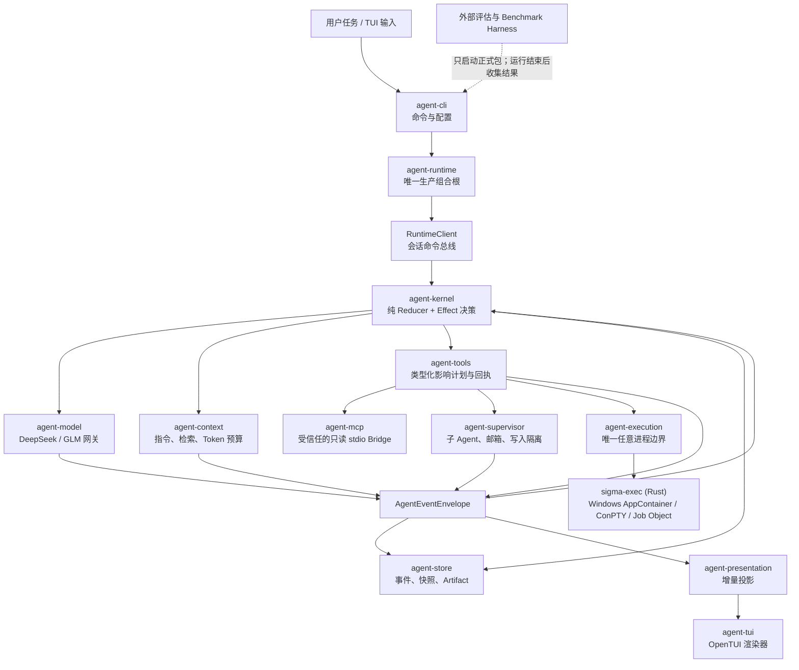

<p align="center">
  
</p>

<h1 align="center">Sigma Code</h1>

<p align="center">
  一个围绕 DeepSeek 构建、强调持久化与证据闭环的 Coding Agent。<br>
  在终端里完成规划、分析、修改、执行、验证、审查与恢复。
</p>

<p align="center">
  <a href="README.md">English</a> · <a href="README.zh-CN.md">简体中文</a>
</p>

<p align="center">
  
  
  
</p>

<p align="center">
  
</p>

Sigma Code 把一次编码任务变成一条可持久化、可验证、可重放的类型化事件流。它可以理解仓库、执行范围明确的修改、在沙箱内运行命令、验证结果、请求独立审查，并在进程中断后恢复原来的会话。CLI 与 TUI 不各自维护一套 Agent：产品只有一个事件溯源内核、一种会话格式和一条执行链。

> [!IMPORTANT]
> **当前产品边界**
>
> - **目前只正式发布 Windows x64 版本。** 仓库中已经存在 Linux 沙箱后端和便携包构建代码，但 Linux 暂时不是正式发布目标。
> - **目前正式评估与 Benchmark 只跑 DeepSeek。** Sigma 的评估系统、Harbor 适配器和 Terminal-Bench harness 都以 DeepSeek 为重点维护；其他 Provider 的结果不用于正式性能声明。
> - 运行时包含 DeepSeek 与 GLM/Z.ai 网关，但 GLM 路径还没有获得与 DeepSeek 相同的正式评估覆盖。
> - Sigma 把 **OpenCode 视为直接竞争对手和追赶目标，而不是已经达到的水平**。就当前整体实际表现与成熟度而言，Sigma 和 OpenCode 仍有真实差距。

## 为什么是 Sigma Code

| 原则 | 在产品中的含义 |
| --- | --- |
| 默认持久化 | 命令、模型轮次、工具回执、授权、计划、证据和最终结果都会写入带校验的事件日志，并且能够重放。 |
| 先声明影响，再执行 | 每个工具先声明最大影响；每次调用再收窄成精确计划，然后才经过模式策略、授权、锁、检查点和执行。 |
| 有证据才算完成 | 一段自然语言总结不能结束任务；完成动作必须为明确的验收标准引用类型正确的当次运行证据。 |
| 沙箱失效即拒绝 | 进程默认运行在无网络的原生沙箱中；要求的沙箱不健康时，Sigma 会拒绝执行，不静默降级到宿主机。 |
| 一条产品执行链 | CLI 自动化和 TUI 共用同一个 `RuntimeClient`、内核、事件仓库、工具、恢复逻辑和结果协议。 |

## Windows 快速开始

从 [GitHub Releases](https://github.com/hututuQQQ/sigma/releases) 下载最新的 Windows x64 压缩包并解压。正式包已经包含固定版本的 Node.js、原生 `sigma-exec` Broker、TUI 运行时、TypeScript/Python Language Server 资源和 Tokenizer 数据，无需另外安装 Node.js。

```powershell
$Sigma = "C:\Tools\sigma-code"
$Workspace = "D:\path\to\your\repository"

$env:DEEPSEEK_API_KEY = "your-api-key"

# 当前 Windows 用户只需要执行一次。
& "$Sigma\bin\agent.cmd" sandbox setup

# 创建工作区配置，检查运行环境与模型连接，然后进入 TUI。
& "$Sigma\bin\agent.cmd" init --workspace $Workspace --provider deepseek
& "$Sigma\bin\agent.cmd" doctor --workspace $Workspace --check-api
& "$Sigma\bin\agent.cmd" tui --workspace $Workspace
```

上面的 API Key 只对当前 PowerShell 进程生效。不要把密钥写进 `.agent/config.toml` 或提交到版本库。

执行一次性的修改任务：

```powershell
& "$Sigma\bin\agent.cmd" run "修复失败的测试并解释修改" `
  --workspace $Workspace `
  --permission-mode auto
```

只读分析仓库：

```powershell
& "$Sigma\bin\agent.cmd" inspect "梳理请求链路并找出可靠性风险" `
  --workspace $Workspace `
  --permission-mode auto
```

`run` 使用 **change** 模式。`inspect` 使用 **analyze** 模式，会拒绝声明了文件写入、不受限进程启动或破坏性影响的工具。

## Sigma 能做什么

- **交互式编码：** 提供适配 CJK、IME 和 Emoji 的终端界面，支持 Markdown、活动视图、命令补全、多行输入、运行中纠偏、后续任务队列、滚动和授权弹窗。
- **仓库理解：** 有界的文件列表与搜索、仓库统计、Git status/diff、带哈希的稳定读取、嵌套 `AGENTS.md` 发现，以及在 Server 可用时启用的 LSP 代码智能。
- **范围明确的修改：** 写入和编辑文件、原子化应用多文件 Patch、删除单个文件、识别无变化写入、创建修改检查点，并恢复当前运行最近一次已密封检查点。
- **沙箱命令执行：** 直接运行可执行文件或平台 Shell、执行语义验证，并通过 Broker 作用域内的会话句柄管理后台进程和 PTY。
- **证据化交付：** 把工作区变更、命令、验证、诊断、审查、子 Agent 结果和检查点统一写入类型化证据账本。
- **持久会话：** 支持列出、查看、重放、恢复、取消、纠偏、授权和继续会话，进程退出不等于任务记录消失。
- **子 Agent 协作：** 把计划节点委托给受预算约束的子会话；写入任务进入 Git Worktree 或窄范围单写者租约，保留的修改需要显式集成。
- **扩展能力：** 在冻结并受信任的边界内加载 Skill、Profile 和 Hook，也可以连接经过显式信任的只读 MCP stdio Server。

## 架构

`agent-runtime.createConfiguredRuntime` 是唯一的生产组合根。模型路由、上下文、纯内核、影响感知工具、MCP Client、分段事件仓库、检查点、Reviewer、Supervisor、执行 Broker 和进程内 `RuntimeClient` 都在这里组装。CLI 负责创建 Runtime；TUI 只接收 RuntimeClient，不会复制一套 Agent 循环。



### 核心事件循环

1. CLI/TUI 命令先变成类型化会话命令和持久事件。
2. `agent-kernel` 把事件流归约为状态并决定下一个 Effect；内核本身不执行 I/O。
3. `agent-runtime` 通过协议端口把决策交给模型、上下文、工具、Store、Reviewer 或 Supervisor。
4. 工具执行前，Sigma 会冻结精确的读写根、网络模式、进程模式、幂等性和检查点范围，再对计划执行模式校验、授权、加锁和信任检查。
5. 执行回执和证据作为新事件追加。内核根据持久状态继续决策，`agent-presentation` 则把同一批事件投影成 CLI/TUI 输出。
6. 一次运行只能以类型化结果结束：`Completed`、`NeedsInput`、`Cancelled`、`RecoverableFailure` 或 `Fatal`。

因此，重放和恢复不是 UI 上额外补出来的功能，而是正常执行模型的一部分。

### 包与分层

| 层 | Package | 职责 |
| --- | --- | --- |
| 协议与配置 | `agent-protocol`、`agent-config` | 事件、命令、结果、端口、工具影响、模型能力，以及统一的 CLI/环境变量/TOML Schema。 |
| 决策引擎 | `agent-kernel` | 纯状态归约、收敛规则、终止协议修复和 Effect 选择。 |
| 智能与上下文 | `agent-model`、`agent-context`、`agent-code-intel`、`agent-extensions` | Provider 流式协议、上下文压缩、仓库指令、LSP、Skill、Profile 与 Hook。 |
| 工具能力 | `agent-tools`、`agent-mcp` | 仓库、文件、进程、控制、Supervisor 工具与 MCP Bridge，全部受声明影响约束。 |
| 安全边界 | `agent-execution`、`agent-platform`、`agent-checkpoint`、`native/sigma-exec` | 路径约束、进程策略、原生沙箱、输出脱敏与 Artifact、事务式恢复。 |
| 持久化与协调 | `agent-store`、`agent-supervisor`、`agent-runtime` | 事件持久化、快照、会话所有权、子 Agent 隔离、恢复、审查和组合。 |
| 产品界面 | `agent-presentation`、`agent-tui`、`agent-cli` | 事件投影、终端交互、自动化命令、会话管理与诊断。 |

生产依赖图会检查循环依赖，各 Package 只能通过公开 Export 交互。

## 安全、权限与恢复

### Windows 执行边界

`agent-execution` 是生产代码中唯一允许启动任意进程的 Package。它通过分帧协议与正式包中的 Rust `sigma-exec` Broker 通信。在 Windows 上，每条沙箱命令都使用独立的 AppContainer 身份和范围化文件 ACL，并通过 kill-on-close Job Object 限制整个进程树；网络能力按调用授予，交互进程使用 ConPTY。

默认策略是 `sandbox=required`、`network=none`。必需沙箱绝不会自动回退到宿主机进程。非安全宿主机执行同时需要 Home 配置授权和当次运行请求。Broker 会从白名单重建子进程环境，拒绝疑似密钥的覆盖项，并从返回输出中脱敏已知密钥值。

路径约束和操作系统隔离是两道独立防线。工作区工具拒绝词法逃逸和符号链接/Junction 逃逸；`.git` 与 `.agent` 不会获得沙箱写权限。

### 检查点与持久状态

运行状态保存在 Agent 无法写入的工作区之外，目录按工作区哈希隔离：

```text
<user-state>/sigma/workspaces/<workspace-sha256>/stores/v4/sessions/<session-id>/
  meta.json
  events/000001.jsonl
  snapshots/000000000250.json
  artifacts/<sha256>
```

事件带校验和与单调递增序号；日志达到 8 MiB 或 10,000 条事件时分段，每 250 条事件和分段时写入快照，末尾撕裂记录可在追加锁内修复。恢复会重新加载待处理授权、Follow-up、动态发现的指令、预算和可安全重试的幂等工作。中断的非幂等 Effect 会进入 `NeedsInput`，不会被静默重放。

### “完成”是协议动作

Provider 返回 `stop`，或者模型写出一段自信的总结，都不代表任务已经完成。模型必须调用 `complete_task`，提供非空总结、明确验收标准，并逐项引用当前运行证据账本中的精确记录。未知、失败、过期或语义不匹配的证据会被拒绝，运行继续，并收到结构化修复诊断。

非文档变更需要通过语义验证和独立审查才能完成。所有非 Detached 子 Agent 会在父任务结束前 Join；仍未集成的 Writer Worktree 也会让父任务保持未完成状态。

## 常用命令

| 命令 | 用途 |
| --- | --- |
| `agent tui --workspace .` | 打开交互式终端界面。 |
| `agent run "..." --workspace .` | 执行允许修改工作区的任务。 |
| `agent inspect "..." --workspace .` | 使用只读工具分析工作区。 |
| `agent sessions --workspace . --json` | 列出持久会话。 |
| `agent session show --latest --workspace .` | 查看最近会话。 |
| `agent replay --latest --workspace . --timeline` | 重放事件时间线。 |
| `agent resume <session-id> --workspace .` | 继续一个持久会话。 |
| `agent cancel <session-id> --workspace .` | 取消活动会话。 |
| `agent approval <session-id> <request-id> --decision allow --workspace .` | 处理待确认授权。 |
| `agent doctor --workspace . --check-api` | 检查配置、沙箱、工具链和 Provider。 |
| `agent sandbox setup` | 准备并自检 Windows 沙箱。 |
| `agent init --workspace .` | 创建 `.agent/config.toml`。 |

稳定退出码：`0` 表示 `Completed`，`2` 表示 `NeedsInput`，`130` 表示 `Cancelled`，`1` 表示可恢复或致命失败。

### TUI 操作

- `Enter`：空闲时提交；运行中立即纠偏
- `Shift+Enter` / `Ctrl+J`：插入换行
- `Alt+Enter`：把消息加入 Follow-up 队列
- `Ctrl+O`：展开或折叠活动信息
- `PgUp` / `PgDn`、`Ctrl+U` / `Ctrl+D`、鼠标滚轮：滚动会话
- `/new`、`/mode analyze|change`、`/followup`、`/activity`、`/help`、`/quit`：会话命令
- 第一次 `Ctrl+C`：取消；1.5 秒内再次按下：退出

## 配置

优先级为 **CLI 参数 → 环境变量 → 工作区 `.agent/config.toml` → Home `~/.sigma/config.toml` → 默认值**。未知参数和未知 TOML Key 会立即报错。由仓库提供的 MCP Server 和可执行 Hook 必须获得与内容摘要绑定的显式信任。

```toml
[model]
provider = "deepseek"
name = "auto"

[permissions]
mode = "ask"

[runtime]
run_deadline_sec = 900
model_deadline_sec = 120
stream_idle_sec = 45

[tools]
max_parallel = 4

[agents]
max_parallel = 4

[ui]
output_format = "text"

[tui]
fps = 30
```

DeepSeek 使用 `DEEPSEEK_API_KEY`。实验性的 GLM/Z.ai 路径也可以读取 `GLM_API_KEY`、`ZAI_API_KEY` 或 `BIGMODEL_API_KEY`，但 Sigma 的正式评估仍然只覆盖 DeepSeek。

## 评估与 Benchmark 边界

Sigma 的正式体验评估器会在全新、不透明的工作区中运行已打包产品，再把持久事件流归约为正确性、安全性、体验与可靠性结果。当前 Manifest 把正式评估固定为 **DeepSeek**（目前为 `deepseek-v4-pro`）；Terminal-Bench 通过专门的 Harbor 兼容 DeepSeek Harness 运行。

评估器可以选择任务、启动正式包，并在运行结束后收集 Artifact；它不能把场景身份、Verifier 输出、分数、Reward、隐藏检查或运行后失败传给求解会话，也不能利用 Verifier 反馈重试求解。协议类型和生产源码扫描会共同约束这条公平性边界。

```powershell
# 不调用模型，只审计已经存在的会话。
pnpm eval:session -- --workspace . --latest 2

# 仅 DeepSeek 的在线评估与 Benchmark 路径。
pnpm eval:agent -- --suite quick
pnpm eval:agent -- --suite experience --repeat 3
pnpm bench:deepseek
```

这些结果不能外推为跨 Provider 的性能结论。

## 构建与开发

仓库固定使用 Node.js `26.4.0`、pnpm `11.7.0` 和 Rust `1.96.0`。

```powershell
corepack enable
corepack prepare pnpm@11.7.0 --activate
pnpm install --frozen-lockfile
pnpm build
cargo build --release --locked --manifest-path native/sigma-exec/Cargo.toml

pnpm lint
pnpm test:coverage
```

构建并验证当前正式目标：

```powershell
pnpm package:agent-cli:windows
pnpm verify:release:windows
```

打包完成后，把开发密钥写入仓库内已被 Git 忽略的 `.env` 文件：

```dotenv
DEEPSEEK_API_KEY=your-api-key
```

然后启动开发 TUI：

```powershell
pnpm tui:deepseek
```

使用 Fake Gateway 的测试不需要 Provider 密钥。覆盖率阈值、真实终端边界、原生沙箱检查、打包证明与发布 Gate 见 [VALIDATION.md](VALIDATION.md)。

## 接下来的方向

Sigma 当前有意保持聚焦：先把 Windows 产品做稳，继续深化 DeepSeek 专用 Harness 与长会话收敛能力，缩小真实任务表现和 OpenCode 的差距，同时坚持把评估反馈隔离在求解边界之外。更多平台和 Provider 的正式支持，应该建立在已经被证明的产品可靠性之上。
