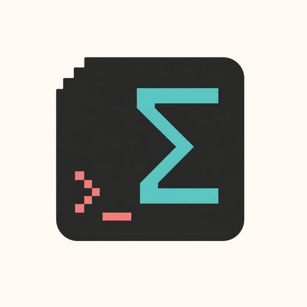
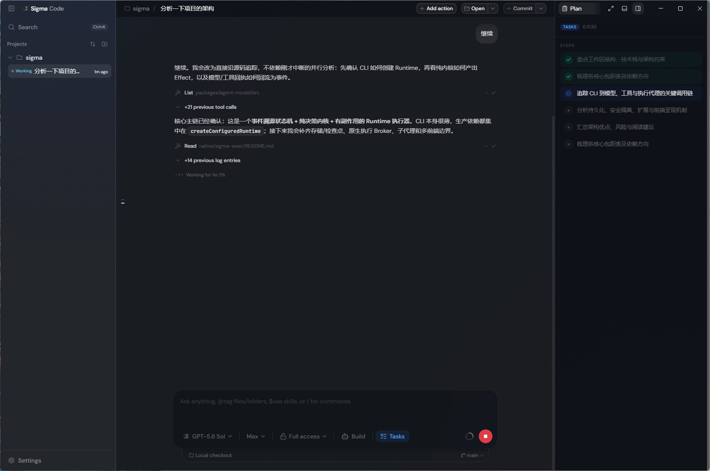
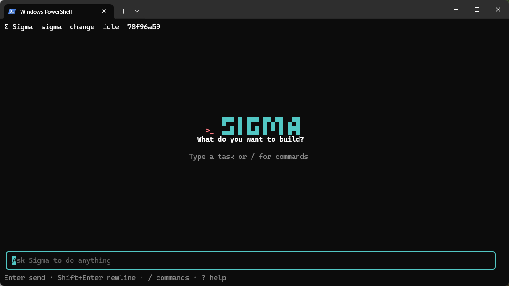
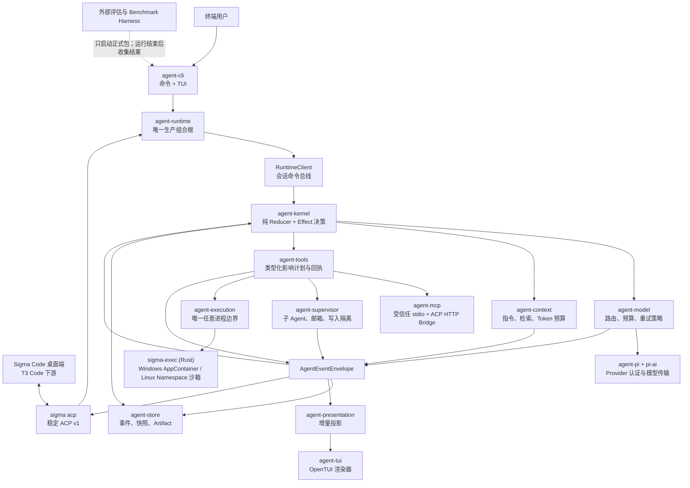

<p align="center">
  
</p>

<h1 align="center">Sigma Code</h1>

<p align="center">
  一个不会因中断丢进度、不会在没有验证时宣称完成的开源 Coding Agent。<br>
  在原生沙箱中运行长任务，随时恢复，并用证据完成交付。
</p>

<p align="center">
  <a href="README.md">English</a> · <a href="README.zh-CN.md">简体中文</a>
</p>

<p align="center">
  <a href="https://github.com/hututuQQQ/sigma/releases/tag/v0.1.5"></a>
  
  
</p>

<p align="center">
  <a href="https://sigmacode.biz"><strong>官方网站</strong></a>
  · <a href="https://github.com/hututuQQQ/sigma/releases/tag/v0.1.5"><strong>下载 v0.1.5</strong></a>
  · <a href="https://github.com/hututuQQQ/sigma-code">桌面客户端源码</a>
  · <a href="SECURITY.md">安全策略</a>
</p>

<p align="center">
  
</p>

<p align="center">
  <sub>
    <a href="https://github.com/hututuQQQ/sigma-code">Sigma Code 桌面客户端</a>是
    <a href="https://github.com/pingdotgg/t3code">T3 Code</a> 的独立维护下游，通过 ACP v1 连接本仓库的 Runtime。
  </sub>
</p>

Sigma Code 面向那些不能丢失任务现场、也不能只凭模型一句“完成了”就结束的编码任务。它在必需的原生沙箱中运行命令，持久保存完整工作会话以便中断后继续，并且只有在当前改动通过验证、满足必要审查后才会完成。本仓库维护 Sigma Runtime、CLI 与 TUI；桌面、Web 和移动客户端位于 [hututuQQQ/sigma-code](https://github.com/hututuQQQ/sigma-code)。所有界面都使用同一个事件溯源内核、会话仓库、工具、恢复逻辑和结果协议，通过进程内 `RuntimeClient` 或稳定 ACP v1 接入。

`0.1.5` 是当前受支持的产品基线。Linux x64 是稳定发布目标；
在取得可信 Authenticode 签名之前，Windows x64 仍必须明确标记为未签名预览版。
提交问题或参与贡献前，请先查看[安全策略](SECURITY.md)和
[贡献指南](CONTRIBUTING.md)。

> [!TIP]
> **OpenCode 对比——同一模型、完整 89 项：** Sigma Code + DeepSeek 完成 **51/89（57.303%）**，OpenCode + DeepSeek 完成 **49/89（55.056%）**，Sigma 多完成 **2 项 / +2.247 个百分点**。双方都在相同的 Terminal-Bench 2.1 任务集合上使用 DeepSeek `deepseek-v4-pro`；Sigma 每项只尝试 1 次、重试为 0，也没有接收 Verifier 反馈。方法与限制见[评估与 Benchmark 边界](#评估与-benchmark-边界)。

> [!IMPORTANT]
> **当前产品边界**
>
> - **[Sigma Code 0.1.5](https://github.com/hututuQQQ/sigma/releases/tag/v0.1.5) 在 Linux x64 上是稳定版；Windows x64 是未签名预览版。** Windows 安装包同时包含 Sigma Code 桌面 UI 和经过验证的 Sigma Runtime，用户无需另外安装 Node.js 或 Agent CLI。发布候选必须通过原生沙箱、打包产品、校验和、SBOM 与签名来源证明门禁；Windows 可执行文件目前没有可信 Authenticode 签名，可能触发 Windows 安全警告。
> - **正式评估由预注册清单约束，而不是写死 Provider。** SHA 绑定的运行清单会在执行前冻结 Provider、模型、源码、归档、任务选择、网络、超时、并发、尝试次数和重试次数。
> - 只有 SHA 绑定的运行清单中的控制条件可比时，Provider 对比才有效；harness 不会根据模型名称推断可比性。

## 为什么是 Sigma Code

| 核心能力 | 对你意味着什么 |
| --- | --- |
| 原生沙箱执行 | 命令始终处于必需的操作系统级隔离中；沙箱不健康时，Sigma 会拒绝执行。 |
| 中断后继续 | 命令、模型轮次、工具回执、计划和结果都会持久保存为带校验的事件，因此同一任务可以恢复和重放。 |
| 有证据才算完成 | 模型的一段自然语言总结不能把改动标记为完成；Sigma 要求当前状态验证和必要的审查证据。 |

## Sigma Code 桌面端与 T3 接入

[Sigma Code 客户端](https://github.com/hututuQQQ/sigma-code)是 [T3 Code](https://github.com/pingdotgg/t3code) 的独立维护桌面、Web 与移动下游。该仓库保留了 T3 Code 原有的许可证和归属说明；此下游项目与 T3 Tools, Inc. 没有关联，也未获得其赞助或背书。

本仓库发布的 Windows 安装包会把客户端与同一 Release 中经过验证的 Sigma Runtime 打包在一起。客户端内置的 Sigma Provider 会启动长驻的 `sigma acp` Server，并通过 stdio 上的换行分隔 JSON-RPC 通信。v0.1.5 的 ACP Bridge 支持：

- 创建、列出、加载、恢复、关闭、取消和纠偏持久会话；
- 流式模型与 Reasoning 文本、计划、工具调用、授权、用量、上下文窗口状态、Hook 和子 Agent 生命周期事件；
- 图片输入、结构化用户问题、以持久事件为准的历史记录，以及仅追加的消息回滚；
- 模型与模型专属推理等级选择、受信任 Skill 发现，以及由客户端提供的 Streamable HTTP MCP Server。

使用内置 Sigma Provider 时，客户端只负责产品界面；执行、权限、沙箱、持久化、验证、审查与恢复仍由 Sigma Runtime 统一负责。

<details>
<summary><strong>终端界面</strong></summary>

<p align="center">
  
</p>

</details>

## Linux 快速开始

从经过验证的项目 Release 获取 `0.1.5` Linux x64 稳定版归档，或从源码构建；
核对 SHA-256 侧文件与签名来源证明后再解压：

```sh
SIGMA="$HOME/.local/share/sigma-code"
WORKSPACE="/path/to/your/repository"

export DEEPSEEK_API_KEY="your-api-key"

"$SIGMA/bin/agent" init --workspace "$WORKSPACE" --provider deepseek
"$SIGMA/bin/agent" doctor --workspace "$WORKSPACE" --check-api
"$SIGMA/bin/agent" tui --workspace "$WORKSPACE"
```

## Windows 快速开始（未签名预览版）

> [!WARNING]
> Windows x64 归档是未签名预览版，不是受信任的正式 Windows 二进制发布。解压前请核对 SHA-256 侧文件与签名来源证明。可执行文件目前没有可信 Authenticode 签名，因此 Windows SmartScreen 或 Smart App Control 可能警告或阻止运行。

如需完整桌面产品，请从 [Sigma Code v0.1.5 Release](https://github.com/hututuQQQ/sigma/releases/tag/v0.1.5)
下载 `Sigma-Code-0.1.5-x64.exe`，核对 SHA-256 侧文件后运行安装程序。
安装包会同时安装 Sigma Code UI 与经过验证的 Sigma Runtime，无需另外安装
Node.js 或 Agent CLI。

安装包中的 UI 来自 [hututuQQQ/sigma-code](https://github.com/hututuQQQ/sigma-code)，并通过 `sigma acp` 启动 Runtime。在 Settings 中选择 Sigma 模型连接，再使用对应 Provider 暴露的方式完成认证。桌面端默认使用实验性的 ChatGPT/Codex 订阅连接；受支持的 Pi Provider 可以通过同一套 Runtime 接口提供 API Key 或 OAuth 登录。

`agent-cli-win32-x64.zip` 仍可用于纯终端或便携场景，其中包含固定版本的
Node.js、原生 `sigma-exec` Broker、TUI 运行时、TypeScript/Python Language
Server 资源和 Tokenizer 数据。

```powershell
$Sigma = "C:\Tools\sigma-code"
$Workspace = "D:\path\to\your\repository"

$env:DEEPSEEK_API_KEY = "your-api-key"

# 当前 Windows 用户只需要执行一次。
& "$Sigma\bin\agent.cmd" sandbox setup

# 创建工作区配置，检查运行环境与模型连接，然后进入 TUI。
& "$Sigma\bin\agent.cmd" init --workspace $Workspace --provider deepseek
& "$Sigma\bin\agent.cmd" doctor --workspace $Workspace --check-api
& "$Sigma\bin\agent.cmd" tui --workspace $Workspace
```

上面的 API Key 只对当前 PowerShell 进程生效。不要把密钥写进 `.agent/config.toml` 或提交到版本库。

发布的归档都会带有 SHA-256 校验和、CycloneDX SBOM、签名的来源证明和
公开验证密钥。Linux x64 在 `0.1.5` 是稳定发布；Windows x64 仍属于未签名预览。
信任边界见 [SECURITY.md](SECURITY.md)，维护者发布流程见
[RELEASING.md](RELEASING.md)。

执行一次性的修改任务：

```powershell
& "$Sigma\bin\agent.cmd" run "修复失败的测试并解释修改" `
  --workspace $Workspace `
  --permission-mode auto
```

只读分析仓库：

```powershell
& "$Sigma\bin\agent.cmd" inspect "梳理请求链路并找出可靠性风险" `
  --workspace $Workspace `
  --permission-mode auto
```

`run` 使用 **change** 模式。`inspect` 使用 **analyze** 模式，会拒绝声明了文件写入、不受限进程启动或破坏性影响的工具。

## Sigma 能做什么

- **桌面与终端交互：** 通过 ACP v1 使用 [Sigma Code 桌面客户端](https://github.com/hututuQQQ/sigma-code)，或使用适配 CJK、IME 和 Emoji 的终端界面；两者都支持实时活动、运行中纠偏和授权交互。
- **统一模型接入：** 搜索固定版本的 Pi 模型目录、管理 Provider 认证、选择模型专属推理等级，并明确区分按量计费、订阅与价格未知三种账单语义。
- **仓库理解：** 有界的文件列表与搜索、仓库统计、Git status/diff、工作区及已声明宿主机输入的稳定哈希读取、嵌套 `AGENTS.md` 发现，以及在 Server 可用时启用的 LSP 代码智能。
- **范围明确的修改：** 写入和编辑文件、原子化应用多文件 Patch、删除单个文件、识别无变化写入、创建修改检查点，并恢复当前运行最近一次已密封检查点。
- **沙箱命令执行：** 直接运行可执行文件或平台 Shell、执行语义验证，通过 Broker 会话句柄管理后台进程和 PTY，并显式交接已验证的 Linux 交付服务。
- **只读 Web 研究：** 使用 `web_run`（文档中写作 `web.run`）搜索、打开、查找和跟随编号静态链接；结果保留持久引用，并始终标记为不受信任的外部内容。
- **证据化交付：** 把工作区变更、命令、验证、诊断、审查、子 Agent 结果和检查点统一写入类型化证据账本。
- **持久会话：** 支持列出、查看、重放、恢复、取消、纠偏、授权和继续会话，进程退出不等于任务记录消失。
- **子 Agent 协作：** 把计划节点委托给受预算约束的子会话；写入任务进入 Git Worktree 或窄范围单写者租约，保留的修改需要显式集成。
- **长会话可靠性：** 在耗尽 Provider 上下文窗口前触发压缩，对瞬态流关闭执行有界恢复，并把 Reviewer 会话和子 Agent Run 与后续轮次隔离。
- **扩展能力：** 在冻结并受信任的边界内加载 Skill、Profile 和 Hook，连接经过显式信任的只读 MCP stdio Server，也可以接收 ACP 客户端提供的只读 Streamable HTTP MCP Server。

## 架构

`agent-runtime.createConfiguredRuntime` 是唯一的生产组合根。模型路由、上下文、纯内核、影响感知工具、MCP Client、分段事件仓库、检查点、Reviewer、Supervisor、执行 Broker 和进程内 `RuntimeClient` 都在这里组装。CLI 负责创建 Runtime；TUI 只接收 RuntimeClient，不会复制一套 Agent 循环，`sigma acp` 则把同一 Runtime 投影给 Sigma Code 等客户端。


```mermaid
flowchart TB
  USER["终端用户"] --> CLI["agent-cli<br/>命令 + TUI"]
  DESKTOP["Sigma Code 桌面端<br/>T3 Code 下游"] <--> ACP["sigma acp<br/>稳定 ACP v1"]
  CLI --> ROOT["agent-runtime<br/>唯一生产组合根"]
  ACP --> ROOT
  ROOT --> CLIENT["RuntimeClient<br/>会话命令总线"]
  CLIENT --> KERNEL["agent-kernel<br/>纯 Reducer + Effect 决策"]

  KERNEL --> MODEL["agent-model<br/>路由、预算、重试策略"]
  MODEL --> PI["agent-pi + pi-ai<br/>Provider 认证与模型传输"]
  KERNEL --> CONTEXT["agent-context<br/>指令、检索、Token 预算"]
  KERNEL --> TOOLS["agent-tools<br/>类型化影响计划与回执"]
  KERNEL --> STORE["agent-store<br/>事件、快照、Artifact"]

  TOOLS --> MCP["agent-mcp<br/>受信任 stdio + ACP HTTP Bridge"]
  TOOLS --> SUP["agent-supervisor<br/>子 Agent、邮箱、写入隔离"]
  TOOLS --> EXEC["agent-execution<br/>唯一任意进程边界"]
  EXEC --> NATIVE["sigma-exec (Rust)<br/>Windows AppContainer / Linux Namespace 沙箱"]

  MODEL --> EVENTS["AgentEventEnvelope"]
  CONTEXT --> EVENTS
  TOOLS --> EVENTS
  SUP --> EVENTS
  EVENTS --> STORE
  EVENTS --> KERNEL
  EVENTS --> PRESENT["agent-presentation<br/>增量投影"]
  PRESENT --> TUI["agent-tui<br/>OpenTUI 渲染器"]
  EVENTS --> ACP

  EVAL["外部评估与 Benchmark Harness"] -.->|"只启动正式包；运行结束后收集结果"| CLI
```

### 核心事件循环

1. CLI、TUI 或 ACP 命令先变成类型化会话命令和持久事件。
2. `agent-kernel` 把事件流归约为状态并决定下一个 Effect；内核本身不执行 I/O。
3. `agent-runtime` 通过协议端口把决策交给模型、上下文、工具、Store、Reviewer 或 Supervisor。
4. 工具执行前，Sigma 会冻结精确的读写根、网络模式、进程模式、幂等性和检查点范围，再对计划执行模式校验、授权、加锁和信任检查。
5. 执行回执和证据作为新事件追加。内核根据持久状态继续决策，`agent-presentation` 与 ACP Bridge 则把同一批事件投影成终端或桌面端更新。
6. 一次运行只能以类型化结果结束：`Completed`、`NeedsInput`、`Cancelled`、`RecoverableFailure` 或 `Fatal`。

因此，重放和恢复不是 UI 上额外补出来的功能，而是正常执行模型的一部分。

### 包与分层

| 层 | Package | 职责 |
| --- | --- | --- |
| 协议与配置 | `agent-protocol`、`agent-config` | 事件、命令、结果、端口、工具影响、模型能力，以及统一的 CLI/环境变量/TOML Schema。 |
| 决策引擎 | `agent-kernel` | 纯状态归约、收敛规则、终止协议修复和 Effect 选择。 |
| 智能与上下文 | `agent-model`、`agent-pi`、`agent-context`、`agent-code-intel`、`agent-extensions` | 模型策略、统一 Pi Provider 传输、上下文压缩、仓库指令、LSP、Skill、Profile 与 Hook。 |
| 工具能力 | `agent-tools`、`agent-web`、`agent-mcp` | 仓库、文件、进程、控制、Supervisor、Brokered Web 研究与 MCP Bridge，全部受声明影响约束。 |
| 安全边界 | `agent-execution`、`agent-platform`、`agent-checkpoint`、`native/sigma-exec` | 路径约束、进程策略、原生沙箱、输出脱敏与 Artifact、事务式恢复。 |
| 持久化与协调 | `agent-store`、`agent-supervisor`、`agent-runtime` | 事件持久化、快照、会话所有权、子 Agent 隔离、恢复、审查和组合。 |
| 产品界面 | `agent-presentation`、`agent-tui`、`agent-cli`；下游 `sigma-code` | 事件投影、终端交互、自动化命令、ACP v1、桌面交互、会话管理与诊断。 |

生产依赖图会检查循环依赖，各 Package 只能通过公开 Export 交互。

## 安全、权限与恢复

### 执行边界

`agent-execution` 是生产代码中唯一允许启动任意进程的 Package。它通过分帧协议与正式包中的 Rust `sigma-exec` Broker 通信。在 Windows 上，每条沙箱命令都使用独立的 AppContainer 身份和范围化文件 ACL，并通过 kill-on-close Job Object 限制整个进程树；网络能力按调用授予，交互进程使用 ConPTY。Linux 使用原生 Namespace 沙箱和进程树清理 Watchdog。

配置 Schema 1 默认使用 `permission_mode=workspace-auto`、
`sandbox=required`、`read_scope=workspace`、`network=full`、`web.mode=auto`、
`process_handoff=allow` 和原生沙箱 Backend。工作区内读取与声明范围内写入自动执行；外部读取、完整网络
和仓库元数据写入仍单独授权。显式设置 `network=none` 或 `network=loopback` 会收窄
能力。沙箱失败绝不回退宿主执行；`container` 模式在真实 OCI 后端不可用时返回
`container_unavailable`。

只有完整网络已启用、Web 模式未禁用且 Broker 声明受限 Web 协议时，Runtime 才会暴露 `web_run`。该会话授权只允许只读 Web 访问，不能授权 Shell、进程或 MCP 网络；Broker 只允许公共 HTTP(S) 80/443 端口，把请求绑定到获批的 Origin 与 Method，并拒绝本地、私有、保留地址、带凭据 URL 和主动浏览器内容。

绝对外部输入通过不跟随链接的稳定遍历读取，并生成包含路径、摘要和大小的 `input_access` 证据；进程只挂载已声明的稳定读取根。目标中读取失败的输入会持续阻止完成，直到同一路径稳定读取成功，本轮生成的替代 Fixture 不能清除义务。

路径约束和操作系统隔离是两道独立防线。工作区工具拒绝词法逃逸和符号链接/Junction 祖先逃逸；创建虚拟环境解释器这类“工作区内链接对象”不会被误判为写入外部目标。`.git` 与 `.agent` 不会获得沙箱写权限。

Linux 仅在安全转交可用时公布 `processHandoff`。`deliverable` 进程使用分离的 stdio，不支持 PTY/stdin，必须先通过独立接口健康检查再调用 `process_handoff`。交接后它脱离会话清理；未交接进程在失败、取消、超时或 Broker 丢失时仍会被终止。Windows 当前不公布该能力并保持 fail closed。

### 检查点与持久状态

运行状态保存在 Agent 无法写入的工作区之外，目录按工作区哈希隔离：

```text
<user-state>/sigma/workspaces/<workspace-sha256>/stores/v1/sessions/<session-id>/
  meta.json
  events/000001.jsonl
  snapshots/000000000250.json
  artifacts/<sha256>
```

事件带校验和与单调递增序号；日志达到 8 MiB 或 10,000 条事件时分段，每 250 条事件和分段时写入快照，末尾撕裂记录可在追加锁内修复。恢复会重新加载待处理授权、Follow-up、动态发现的指令、预算和可安全重试的幂等工作。中断的非幂等 Effect 会进入 `NeedsInput`，不会被静默重放。

### “完成”是协议动作

Provider 返回 `stop` 只会产生 `model_stopped`。Completion Coordinator 独立推导当前变更所需的 assurance 与 review；只有 `model_stopped`、`assurance_satisfied` 和 `review_satisfied` 同时成立才会写入 `run.completed`。失败、过期、弱化或不完整的语义验证会进入修复或 typed blocker，模型没有可以绕过完成门的工具。

所有净变更都需要当前状态上的语义验证。已密封的 no-op 检查点不会推进 frontier；
会写文件的验证在检查点密封后重新绑定最终 frontier。标准 Profile 要求当前 frontier
的审查通过，或由用户显式使用一次性 waiver；严格 Profile 不接受 waiver，并要求审查者
亲自执行检查后通过。所有非 Detached 子 Agent 会在父任务结束前 Join；仍未集成的
Writer Worktree 也会让父任务保持未完成状态。

### 当前序列化与工具契约

- Sigma 自有序列化边界只接受严格的 `schemaVersion: 1`（TOML 使用
  `schema_version = 1`；本地 Provider、工作区 Trust 和 ACP Index 使用 `version: 1`）。
  未知 Schema、当前版本但结构损坏的文档、其他 Store Layout 和旧 Checkpoint Journal
  分别以 `unsupported_schema_version`、`persisted_state_invalid` 或
  `unsupported_store_layout` 拒绝；原文件不会被迁移、覆盖或删除。
- 经过验证的 Shell 只暴露一个用于前台执行、验证、后台进程和一次性环境的 `shell`
  契约；只有无法提供已验证 Shell 时，才注册直接 `exec`、`validate` 与
  `process_spawn`。已退役的工具名与参数形状不会为了重放重新注册。
- 主动审查是只读的，并在一次性 Overlay 中执行检查。它可以查看已认证的当前 frontier
  与持久进程生命周期证据，但不能写入父工作区。
- 普通求解预算耗尽时，已经启动的 session 进程可在总 Deadline 内完成结算。
  Deliverable 进程在独立健康检查和 `process_handoff` 成功之前仍归 session 管理。
- `write` 与 `edit` 返回结果字节数和 SHA-256；`write_chunk` 以预映像长度与摘要做原子
  追加。未指定 Shell 时由 Broker 确定性选择。非 UTF-8 进程输出必须保存在字节安全
  Artifact 中；只有解码错误而没有 Artifact 会被视为 Broker 协议错误。
- `inspect_image` 与 `inspect_document` 是面向纯文本模型的有界、离线、只读兜底；
  OCR 或提取元数据只是检查信息，不是完成证据。

## 常用命令

| 命令 | 用途 |
| --- | --- |
| `agent tui --workspace .` | 打开交互式终端界面。 |
| `agent run "..." --workspace .` | 执行允许修改工作区的任务。 |
| `agent inspect "..." --workspace .` | 使用只读工具分析工作区。 |
| `sigma acp` | 通过 stdio 上的换行分隔 JSON-RPC 提供稳定 ACP v1，供 Sigma Code 等客户端使用。 |
| `agent sessions --workspace . --json` | 列出持久会话。 |
| `agent session show --latest --workspace .` | 查看最近会话。 |
| `agent replay --latest --workspace . --timeline` | 重放事件时间线。 |
| `agent resume <session-id> --workspace .` | 继续一个持久会话。 |
| `agent cancel <session-id> --workspace .` | 取消活动会话。 |
| `agent approval <session-id> <request-id> --decision allow --workspace .` | 处理待确认授权。 |
| `agent doctor --workspace . --check-api` | 检查配置、沙箱、工具链和 Provider。 |
| `sigma auth list --json` | 离线列出 Pi Provider 的认证方式及本地/环境认证状态。 |
| `sigma auth status <provider> --json` | 离线读取指定 Provider 的本地认证状态，不刷新 OAuth。 |
| `sigma auth login <provider> --method <method-id> --json` | 启动机器可读的 API Key 或 OAuth 登录流程。 |
| `sigma auth logout <provider> --json` | 删除该 Provider 的本地凭据；环境凭据仍会显示。 |
| `sigma models list --json` | 读取固定版本的静态模型目录与离线动态缓存。 |
| `sigma models refresh <provider> --json` | 显式刷新动态 Provider 的模型目录。 |
| `agent sandbox setup` | 准备并自检 Windows 沙箱。 |
| `agent init --workspace .` | 创建 `.agent/config.toml`。 |

稳定退出码：`0` 表示 `Completed`，`2` 表示 `NeedsInput`，`130` 表示 `Cancelled`，`1` 表示可恢复或致命失败。

### TUI 操作

- `Enter`：空闲时提交；运行中立即纠偏
- `Shift+Enter` / `Ctrl+J`：插入换行
- `Alt+Enter`：把消息加入 Follow-up 队列
- `Ctrl+O`：展开或折叠活动信息
- `PgUp` / `PgDn`、`Ctrl+U` / `Ctrl+D`、鼠标滚轮：滚动会话
- `/new`、`/mode analyze|change`、`/followup`、`/activity`、`/help`、`/quit`：会话命令
- 第一次 `Ctrl+C`：取消；1.5 秒内再次按下：退出

## 配置

优先级为 **CLI 参数 → 环境变量 → 工作区 `.agent/config.toml` → Home `~/.sigma/config.toml` → 默认值**。未知参数和未知 TOML Key 会立即报错。由仓库提供的 MCP Server 和可执行 Hook 必须获得与内容摘要绑定的显式信任。

正式包默认使用实验性的 `openai-codex` 订阅 Provider，并自动选择模型。下面的示例显式选择 DeepSeek，适用于 API Key 配置：

```toml
schema_version = 1

[model]
provider = "deepseek"
name = "auto"
reasoning_effort = "auto"

[permissions]
mode = "workspace-auto"

[security]
sandbox = "required"
read_scope = "workspace"
network = "full"
process_handoff = "allow"

[web]
mode = "auto"
search_provider = "exa"

[runtime]
run_deadline_sec = 0
model_deadline_sec = 120
stream_idle_sec = 45

[tools]
max_parallel = 4

[agents]
max_parallel = 4

[ui]
output_format = "text"

[tui]
fps = 30
```

`runtime.run_deadline_sec = 0` 表示交互式 Run 不设置整体墙钟时限。只有调用方确实需要限制整次任务时才应改为正数；Provider 请求和工具调用仍有独立的活性超时，因此不会因为取消整体 Deadline 而失去中断挂起请求或进程的能力。

如需逐次申请更宽的外部能力：

```toml
schema_version = 1

[security]
sandbox = "required"
read_scope = "host"
network = "full"
process_handoff = "deny"
```

`agent init` 会直接写入当前 Schema。Sigma 不提供配置迁移命令，也不会读取其他持久
Store Layout。需要保留的不兼容状态应由用户自行备份或移动；拒绝过程始终只读。

### ChatGPT/Codex 订阅 Provider（实验性）

Sigma 可以继续使用自己的 Runtime、工具、恢复、预算、Reviewer、Strategist 和持久状态，只把模型请求发送到 ChatGPT/Codex 订阅：

```toml
[model]
provider = "openai-codex"
name = "gpt-5.6-terra"
reasoning_effort = "max"
```

这条路径使用 ChatGPT OAuth 与 `https://chatgpt.com/backend-api/codex/responses`，不会读取 `OPENAI_API_KEY`，也不使用 API Key 计费。凭据由同一主机上的 Sigma 进程共享并保存在 `~/.sigma/auth.json`。订阅调用仍记录 Token 用量，但 `billingMode` 为 `subscription`，API 成本为 null。认证、额度、限流、网络、超时和 Server 错误会原样返回；内置订阅路径只有一个候选，不会静默回退到 DeepSeek、GLM 或 `api.openai.com/v1`。

`reasoning_effort` 支持 `auto`、`none`、`low`、`medium`、`high`、`xhigh` 与 `max`；等价 CLI 参数为 `--reasoning-effort`。实际可选等级来自具体模型的 Pi 元数据，不支持的等级不会出现在 ACP 或模型目录中。

供可信桌面客户端使用的 JSONL 登录接口为：

```text
sigma auth status openai-codex --json
sigma auth login openai-codex --method browser --json
sigma auth login openai-codex --method device-code --json
sigma auth logout openai-codex --json
```

对 Codex Transport，Sigma 会保持稳定的 Prompt 前缀以使用带缓存的 WebSocket Continuation，在流开始前可以回退到 SSE，把过早关闭的流归类为可有界重试的瞬态失败，并隔离 Solver 与 Reviewer 的传输会话。上下文压缩会在耗尽 Provider 窗口之前启动，而不是等到硬溢出后再处理。

### 统一 Pi Provider 网关

所有模型 I/O 都由 `agent-pi` 负责，并固定使用 `@earendil-works/pi-ai@0.82.1`。固定目录包含 Pi 的 38 个内置 Provider、1,109 个静态模型，以及 Sigma 历史 `glm` 兼容 Provider 与 Endpoint。`agent-model` 只承担策略层职责：选择显式路由、预留预算、分类失败、执行重试/回退规则并跟踪 Provider 健康状态。

Provider 凭据与动态模型缓存分别存储在 `~/.sigma/auth.json` 和 `~/.sigma/models.json`，都采用原子替换、跨进程锁和仅当前用户可读写的权限。读取目录或认证状态不会联网；只有显式刷新模型、完成登录或正常模型请求才会访问网络。

模型连接支持 `HTTP_PROXY`、`HTTPS_PROXY`、`ALL_PROXY` 与 `NO_PROXY`。Windows 桌面端或 ACP 进程在没有代理环境变量时，可以读取当前用户已启用的静态 Windows Internet Settings 代理；显式环境变量优先，回环流量始终绕过代理。

计费状态明确区分 `metered`、`subscription` 与 `unpriced`。订阅或价格未知的调用仍保留 Token 用量，并以 null 表示未知金额，不会显示为 0 美元。价格未知的模型默认被拒绝，只有当前任务显式使用 `--allow-unpriced-costs` 或 `budget.allow_unpriced_costs = true` 时才可执行；已知模型的金额、Token、轮次和工具预算仍然有效。

ChatGPT 订阅认证与 API Key 计费彼此独立。这里使用的 Backend 通过固定版本的 Pi 社区 Adapter 接入，并不是具有稳定性承诺的公开第三方 API，因此升级必须显式更新依赖并通过契约测试。

DeepSeek 使用 `DEEPSEEK_API_KEY`。实验性的 GLM/Z.ai 路径也可以读取 `GLM_API_KEY`、`ZAI_API_KEY` 或 `BIGMODEL_API_KEY`。Web 搜索使用 [Exa 托管 MCP 服务](https://exa.ai/docs/reference/exa-mcp)；`EXA_API_KEY` 可选，429 响应会提示操作者配置密钥，不会静默切换 Provider。只有 Provider 被明确冻结进本次预注册清单时，它才属于该次正式结果的一部分。

## 评估与 Benchmark 边界

Sigma 的正式体验评估器会在全新、不透明的工作区中运行已打包产品，再把持久事件流
归约为正确性、安全性、体验与可靠性结果。Terminal-Bench 正式运行必须提供
`SigmaFormalRunPreregistration`；代码不提供正式 dataset、模型、配额、重试或分数
阈值默认值。

评估器可以选择任务、启动正式包，并在运行结束后收集 Artifact；它不能把场景身份、Verifier 输出、分数、Reward、隐藏检查或运行后失败传给求解会话，也不能利用 Verifier 反馈重试求解。协议类型和生产源码扫描会共同约束这条公平性边界。

### Terminal-Bench 2.1：Sigma Code + DeepSeek 对比 OpenCode + DeepSeek

2026 年 7 月 27–28 日完成的分阶段诊断运行，使用 DeepSeek
`deepseek-v4-pro`，在同一组 89 个 Terminal-Bench 2.1 任务上对比两个
Agent。Sigma 侧最大并发为 5，每个任务只尝试 1 次，重试为 0，也没有把
Verifier 反馈传回求解 Agent。

| Agent | 完成项 | 通过率 |
| --- | ---: | ---: |
| **Sigma Code + DeepSeek** | **51/89** | **57.303%** |
| OpenCode + DeepSeek | 49/89 | 55.056% |
| **差值** | **+2 项** | **+2.247 个百分点** |

报告始终使用完整 89 项作为分母，其中 6 个经审计确认由外部原因造成的 Sigma 基础设施无效观测仍按未通过计入。每个源码修订只运行此前尚未消费的任务，因此这是混合源码诊断结果，不是最终 PR HEAD 的单版本分数。没有重跑已消费任务，最后一次观测后完成的通用生命周期修复也有意不计入本次分数。源码边界、止损与验证记录见
[PR #73](https://github.com/hututuQQQ/sigma/pull/73)。

```powershell
# 不调用模型，只审计已经存在的会话。
pnpm eval:session -- --workspace . --latest 2

# 在线评估需要显式提供 Provider/模型控制。
pnpm eval:agent -- --suite quick
pnpm eval:agent -- --suite experience --repeat 3

# 创建并消费不可变的正式运行清单。
pnpm bench:tb:preregister -- --draft formal-draft.json --output formal-run.json
pnpm bench:tb:formal -- --preregistration-file formal-run.json --expected-preregistration-sha256 <sha256> --batch <batch-id>
```

这些结果不能外推为跨 Provider 的性能结论。

## 构建与开发

仓库固定使用 Node.js `26.4.0`、pnpm `11.7.0` 和 Rust `1.96.0`。

```powershell
corepack enable
corepack prepare pnpm@11.7.0 --activate
pnpm install --frozen-lockfile
pnpm build
cargo build --release --locked --manifest-path native/sigma-exec/Cargo.toml

pnpm lint
pnpm test:coverage

# 需要已打包 CLI、模型 Provider 密钥和实时网络。
pnpm smoke:web:live
```

构建并验证当前 Windows 预览候选：

```powershell
pnpm package:agent-cli:windows
pnpm verify:release:windows
```

打包完成后，把开发密钥写入仓库内已被 Git 忽略的 `.env` 文件：

```dotenv
DEEPSEEK_API_KEY=your-api-key
# 可选；托管 Exa MCP Endpoint 不配置密钥也可以使用。
EXA_API_KEY=your-exa-key
```

然后启动开发 TUI：

```powershell
pnpm tui:deepseek
```

使用 Fake Gateway 的测试不需要 Provider 密钥。覆盖率阈值、真实终端边界、原生沙箱检查、打包证明与发布 Gate 见 [VALIDATION.md](VALIDATION.md)。

## 许可证

Sigma Code 采用 [MIT License](LICENSE) 开源。

## 接下来的方向

Sigma 当前有意保持聚焦：继续提高 Windows 桌面端与 ACP 的可靠性，深化长会话收敛能力，缩小真实任务表现差距，同时坚持把评估反馈隔离在求解边界之外。更多平台和 Provider 的正式声明，应该建立在可复现的预注册和已经被证明的产品可靠性之上。
